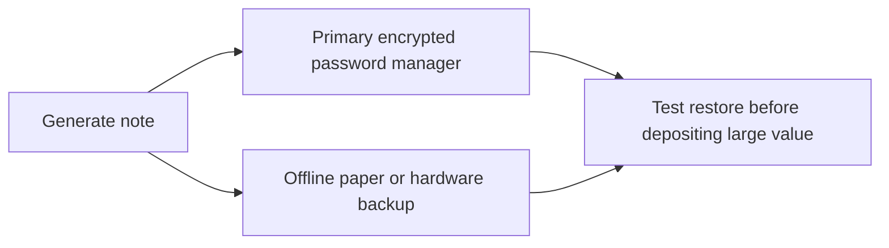

# Secure Coding and User Safety Guidelines

PrivacyLayer is a privacy-sensitive system, not a normal CRUD application. A
mistake here can cause one of three outcomes:

- users lose funds
- users lose privacy
- maintainers lose the ability to safely respond during an incident

That means contributors and users both need a stronger security posture than
they might use on an ordinary web project.

## 1. Note Management

The most important user-side secret in PrivacyLayer is the note material used to
prove ownership of a deposit. If a note is lost, recovery may be impossible. If
it is leaked, someone else may be able to withdraw first.

Best practices:

- Generate note material on a trusted device.
- Store backups in at least two physically separate places.
- Never paste notes into chat apps, issue comments, or analytics tools.
- Do not screenshot notes and leave them in cloud photo sync.
- Treat the note like a private key, not like a password reset token.

Recommended backup model:

Practical examples:

- Good: export the note into an encrypted password vault and a sealed offline
  paper backup.
- Bad: copy the note into a Discord DM or a plain-text file on a synced desktop.

## 2. Privacy Practices

Zero-knowledge proofs hide the direct on-chain linkage between deposit and
withdrawal, but they do not automatically hide timing, address reuse, wallet
behavior, network metadata, or poor operational decisions.

To preserve privacy as much as possible:

- Wait between deposit and withdrawal whenever the protocol design allows it.
- Avoid depositing and withdrawing from addresses that are already strongly
  linked to your identity.
- Do not reuse the same wallet cluster for every step of the flow.
- Avoid obvious behavioral patterns such as fixed-time withdrawals immediately
  after each deposit.
- Minimize off-chain disclosures that reveal which deposits are yours.

### What privacy the protocol can provide

- It can hide the specific source deposit behind a valid proof and Merkle root.
- It can prevent a direct public chain link from deposit to withdrawal.
- It can help users participate in an anonymity set.

### What the protocol cannot provide by itself

- It cannot stop users from deanonymizing themselves through wallet reuse.
- It cannot fix a tiny anonymity set.
- It cannot hide network metadata if users leak it elsewhere.
- It cannot protect a user who shares the note or the withdrawal plan.

## 3. Operational Security

Whether you are a contributor, auditor, relayer operator, or future maintainer,
operational security matters as much as code correctness.

Baseline rules:

- Use hardware-backed keys for admin or deployment actions.
- Separate day-to-day development accounts from privileged deployment accounts.
- Keep build machines patched and reproducible where possible.
- Never store production secrets in `.env` files committed to disk.
- Rotate secrets after any suspected workstation compromise.

For maintainers specifically:

- Admin keys should be controlled by more than one person before mainnet use.
- Emergency contacts and escalation paths should be written down before launch.
- Verifying-key changes should always require explicit review and logging.

## 4. Common User Mistakes

Users commonly break their own privacy through routine habits. The guide should
therefore speak plainly:

- Reusing the same withdrawal address repeatedly weakens unlinkability.
- Withdrawing immediately after deposit reduces the effective anonymity set.
- Discussing your specific deposit publicly can destroy privacy even if the
  proof is mathematically sound.
- Sending the note to customer support, friends, or issue threads is unsafe.
- Using compromised or extension-heavy browsers can leak metadata.

## 5. Threat Model in Plain Language

Threat-model language can be intimidating, so contributors should translate it
for users and operators:

- **Fund theft** means someone finds a way to withdraw without rightful note
  ownership.
- **Double spend** means the same note is used twice.
- **Privacy leakage** means observers narrow down which deposit likely funded a
  withdrawal.
- **Admin abuse** means governance or key custody can change the system in ways
  users did not expect.

Plain-language warning for users:

> PrivacyLayer may hide direct on-chain links, but it does not guarantee perfect
> anonymity if you reuse wallets, move too quickly, or disclose off-chain
> information.

## 6. Emergency Procedures

When something goes wrong, panic creates secondary damage. Security guidance
must therefore include calm, concrete steps.

If you suspect your note was exposed:

1. Assume the note may already be compromised.
2. Do not share the note further while seeking help.
3. If the system supports a safe withdrawal path, move quickly and privately.
4. Watch official project channels for incident instructions.

If you suspect your wallet device is compromised:

1. Stop using the device for new deposits or administrative actions.
2. Move unrelated assets to a safe wallet if possible.
3. Rotate secrets and revoke suspicious sessions.
4. Review whether any stored notes may have been exposed.

If maintainers pause the protocol:

- Read the incident notice fully before taking action.
- Do not rely on rumors or partial screenshots.
- Wait for a post-incident summary explaining whether the issue was about fund
  safety, privacy, or availability only.

## 7. Secure Contributor Behavior

Contributors can improve or harm the repository before code ever reaches review.

Good contributor habits:

- Open small, explainable PRs.
- Reference the exact files or invariants being changed.
- Add regression coverage for edge cases.
- Call out limits honestly when local tooling is incomplete.
- Avoid introducing dependencies for convenience alone.

Bad contributor habits:

- silent verifier or admin-flow changes
- docs that overclaim privacy guarantees
- force-pushing hidden semantic changes after review
- leaving incident-response or recovery behavior undocumented

## 8. Release Checklist for Sensitive Changes

Before shipping a change affecting deposits, withdrawals, proofs, or admin
controls, contributors should ask:

- Does this change alter public inputs, serialization, or verifier semantics?
- Does this change expand admin authority or config mutability?
- Does this change reduce privacy through metadata, logging, or UI defaults?
- Does this change require migration or note-format communication?
- Does this change add a dependency or toolchain assumption?

If the answer is yes to any of the above, the PR should include a dedicated
security note, not just a passing mention.
