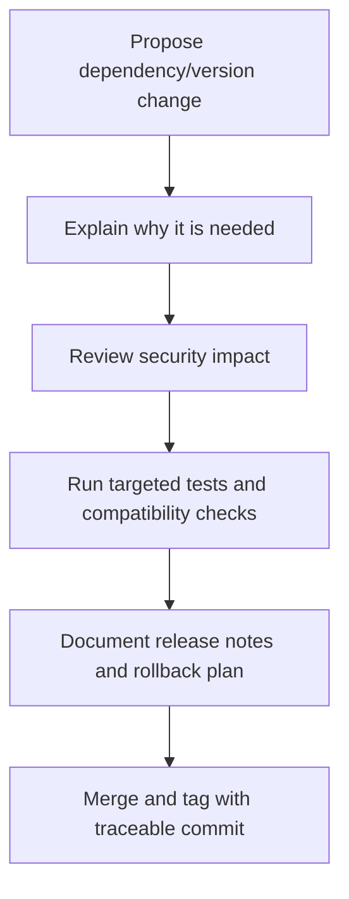

# Versioning, Dependencies, and Supply-Chain Safety

Many privacy and smart-contract failures do not begin with contract logic at
all. They begin with a build that was not reproducible, a dependency that was
never reviewed, or a release that bundled several risky changes together.

This section focuses on the supply chain around PrivacyLayer.

## 1. Dependency Principles

When adding or updating dependencies:

- prefer fewer dependencies over more dependencies
- prefer well-maintained libraries with visible security posture
- pin versions intentionally rather than drifting automatically
- document why a dependency is needed, not just what it does

For this repository, dependency risk exists in several layers:

- Rust crates for Soroban contracts
- Noir tooling and proving stack
- future SDK/frontend packages
- CI and scripting dependencies

Questions maintainers should ask before accepting a dependency:

1. Is this dependency security-critical?
2. Does it parse attacker-controlled input?
3. Does it affect proving, verification, serialization, or cryptography?
4. Can the same result be achieved with existing dependencies?
5. Is there a stable update policy and a public security track record?

## 2. Versioning Strategy

Security-sensitive projects should avoid vague release semantics. A user or
auditor must be able to tell whether a new version changes:

- contract behavior
- circuit semantics
- proof format
- deployment requirements
- admin powers

Recommended approach:

- Use explicit release notes for every contract or circuit change.
- Separate documentation-only releases from security-relevant releases.
- Treat verifier-key or proof-compatibility changes as high-risk version bumps.
- Preserve a clear mapping between tagged versions and deployed artifacts.

## 3. Build and Artifact Integrity

If a release cannot be reproduced or matched to source, users and auditors are
forced to trust the release pipeline blindly.

Minimum expectations:

- keep source control history linear enough to audit
- tag releases with human-readable notes
- record exactly which commit produced each build artifact
- avoid manual hotfixes that bypass the normal build path

For future production readiness, PrivacyLayer should aim for:

- reproducible contract build steps
- documented Noir/prover version requirements
- checksums for published artifacts
- changelogs that call out compatibility breaks

## 4. Review Rules for Dependency Changes

Every dependency PR should include:

- the motivation for the change
- the direct files or workflows impacted
- any known security tradeoffs
- whether lockfiles or generated artifacts changed
- whether the change affects audits or reproducibility

Dependency changes should get stricter review if they affect:

- serialization
- cryptography
- proof generation
- verifier behavior
- deployment scripts

## 5. Safe Update Workflow

A secure update flow should look like this:

This may sound heavy, but the alternative is much worse: a project that cannot
tell users what changed when privacy or fund safety is on the line.

## 6. Avoiding Supply-Chain Complacency

It is common to assume that cryptographic correctness in the main code is the
only thing that matters. In practice, attackers also look for:

- typosquatted packages
- compromised build scripts
- malicious transitive dependencies
- CI secrets exposed through logs or forks
- mismatched local and CI toolchains

Defensive habits:

- inspect lockfile diffs carefully
- avoid bulk dependency upgrades without explanation
- review generated files when they change
- rotate CI secrets when repository settings change
- separate experimental tooling from production release workflows

## 7. Release Communication

Versioning is not just a technical concern; it is a communication contract with
users and reviewers.

Release notes should clearly state:

- whether note formats or proof assumptions changed
- whether users must redeposit or migrate anything
- whether contract addresses or verifying keys changed
- whether a release is documentation-only, test-only, or security-relevant

If a release changes privacy assumptions, say so directly. Do not bury it in a
generic changelog bullet.
