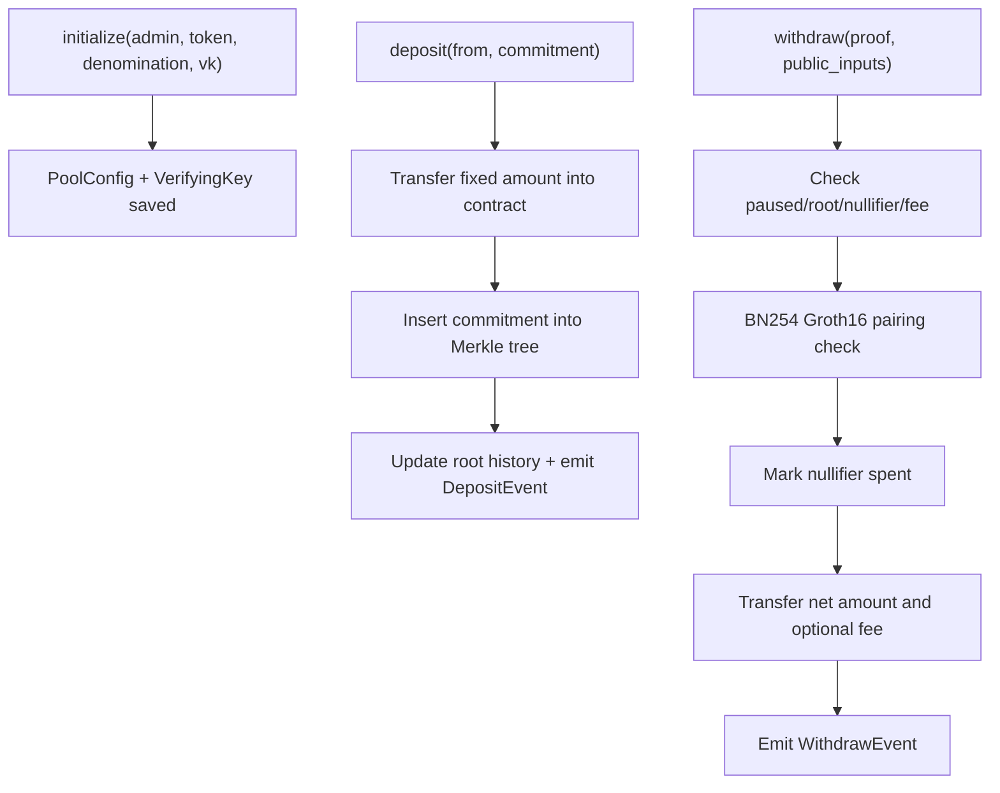
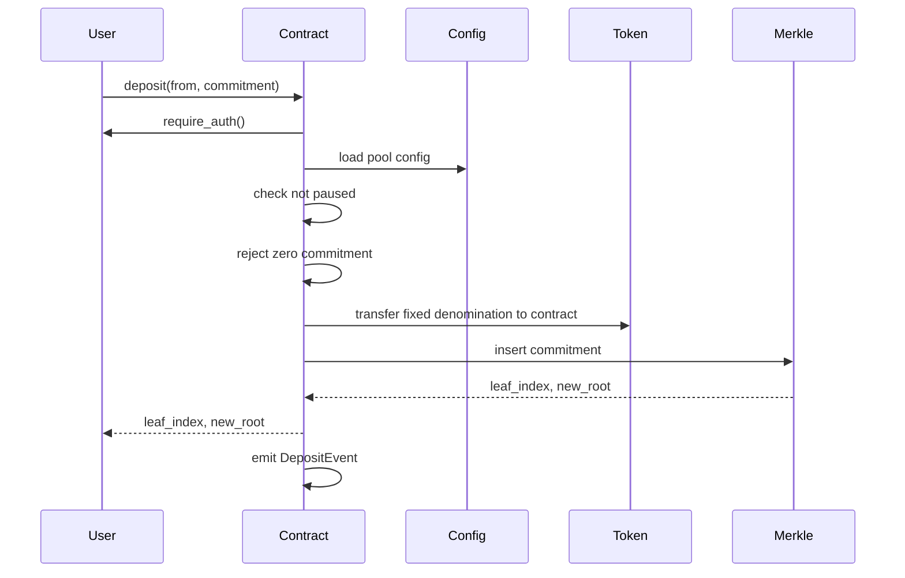
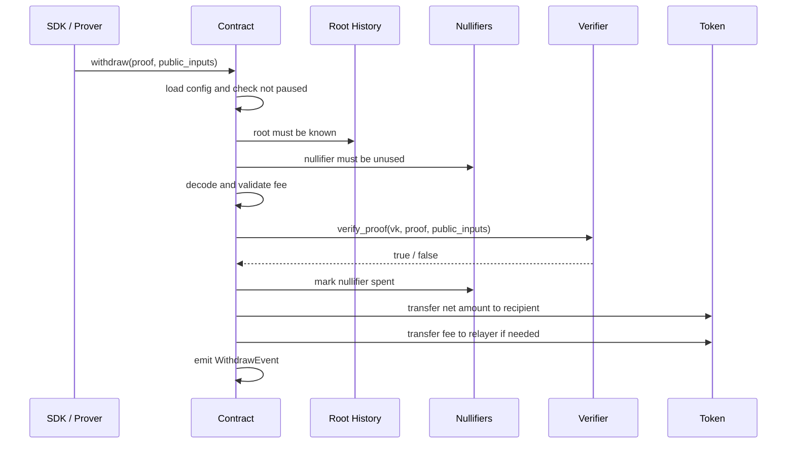

# PrivacyLayer Contract Architecture

This document explains the architecture of the `contracts/privacy_pool` Soroban
contract, why the modules are split the way they are, how deposits and
withdrawals move through the system, and which design choices matter most for
security, privacy, and performance.

The intended audience is:

- contributors extending the pool logic
- auditors reviewing the contract and its cryptographic boundary
- SDK and frontend developers integrating with the contract

The codebase is deliberately modular. The public contract surface is small, but
the implementation spans storage, cryptographic helpers, validation utilities,
admin controls, and event emission. This document focuses on the actual code in:

- `src/contract.rs`
- `src/core/*`
- `src/crypto/*`
- `src/storage/*`
- `src/types/*`
- `src/utils/*`

## 1. Overview

PrivacyLayer is a fixed-denomination shielded pool for Stellar Soroban. Users
deposit a supported denomination into the pool with a commitment, and later
withdraw the same denomination to a fresh recipient by presenting a Groth16
proof that shows knowledge of a valid note in the Merkle tree without linking
that withdrawal to a specific deposit.

At a high level, the contract is responsible for four things:

1. storing the immutable pool configuration and dynamic tree state
2. accepting deposits and appending commitments into an incremental Merkle tree
3. verifying withdrawals through nullifier checks, root-history checks, and a
   BN254 pairing check
4. exposing limited admin controls for pause/unpause and verifying-key rotation

The contract does not generate proofs, notes, or Merkle paths on-chain. Those
operations are assumed to happen in the SDK and proving layer. The on-chain
contract acts as the settlement and verification boundary.

### System Architecture

```mermaid
flowchart LR
    User["User / Wallet"] --> SDK["Client SDK / Prover"]
    SDK -->|deposit(commitment)| Contract["PrivacyPool contract"]
    SDK -->|withdraw(proof, public_inputs)| Contract

    Contract --> Core["core/*"]
    Core --> Storage["storage/*"]
    Core --> Crypto["crypto/*"]
    Core --> Utils["utils/*"]
    Core --> Events["types/events.rs"]

    Crypto --> Merkle["crypto/merkle.rs"]
    Crypto --> Verifier["crypto/verifier.rs"]

    Storage --> Config["Config + VK"]
    Storage --> Tree["TreeState + roots + filled subtrees"]
    Storage --> Nullifiers["Spent nullifiers"]
```

### Data Flow Summary



## 2. Contract Module Breakdown

The module layout mirrors the contract's trust boundaries and makes each layer
easier to review in isolation.

| Module | Primary responsibility | Key files |
| --- | --- | --- |
| Public API | Exposes the Soroban contract interface and delegates work | `src/contract.rs` |
| Core logic | Implements deposits, withdrawals, admin actions, initialization, views | `src/core/deposit.rs`, `src/core/withdraw.rs`, `src/core/admin.rs`, `src/core/initialize.rs`, `src/core/view.rs` |
| Cryptography | Merkle tree maintenance and Groth16 verification helpers | `src/crypto/merkle.rs`, `src/crypto/verifier.rs` |
| Storage | Reads and writes configuration and nullifier state | `src/storage/config.rs`, `src/storage/nullifier.rs` |
| Shared types | Defines storage keys, public inputs, proofs, events, and errors | `src/types/state.rs`, `src/types/events.rs`, `src/types/errors.rs` |
| Utilities | Common validation and address decoding | `src/utils/validation.rs`, `src/utils/address_decoder.rs` |

### Why this split matters

`src/contract.rs` is intentionally thin. It only exposes the contract methods
and forwards execution into the relevant module. That keeps the public entry
points readable and reduces the risk of mixing orchestration, validation, and
state mutation in one file.

For example, the public API surface is intentionally compact:

```rust
pub fn initialize(
    env: Env,
    admin: Address,
    token: Address,
    denomination: Denomination,
    vk: VerifyingKey,
) -> Result<(), Error>

pub fn deposit(
    env: Env,
    from: Address,
    commitment: BytesN<32>,
) -> Result<(u32, BytesN<32>), Error>

pub fn withdraw(
    env: Env,
    proof: Proof,
    pub_inputs: PublicInputs,
) -> Result<bool, Error>
```

`src/core/*` owns workflow order. For example, `withdraw::execute` is where the
contract decides that root validation must happen before proof verification and
that nullifiers are marked spent only after the proof passes. That sequencing is
the business logic of the protocol, not merely a utility concern.

`src/crypto/*` isolates the cryptographic mechanics. The Merkle module knows how
to compute and store roots; the verifier module knows how to build the Groth16
linear combination and pairing equation. This makes auditing easier because the
most sensitive math lives behind a narrow API surface.

`src/storage/*` centralizes persistence. The configuration and verifying key are
stored separately, while nullifier state is keyed by hash. This prevents storage
layouts from leaking into the higher-level business logic.

## 3. Persistent State Design

The main storage namespace is defined in `src/types/state.rs` through the
`DataKey` enum. Each variant maps to a durable Soroban storage slot.

### Storage Keys

| Key | Stored value | Purpose |
| --- | --- | --- |
| `Config` | `PoolConfig` | Pool metadata and runtime flags |
| `TreeState` | `TreeState` | Current root index and next insertion index |
| `Root(u32)` | `BytesN<32>` | Circular history of recent Merkle roots |
| `FilledSubtree(u32)` | `BytesN<32>` | Cached subtree values for incremental insertion |
| `Nullifier(BytesN<32>)` | `bool` | Double-spend protection |
| `VerifyingKey` | `VerifyingKey` | Current Groth16 verification key |

### Pool Configuration

`PoolConfig` stores:

- `admin`: privileged address for pause and verifying-key rotation
- `token`: the token contract used by the pool
- `denomination`: a fixed amount enum, not a user-chosen amount
- `tree_depth`: copied from the Merkle module at initialization
- `root_history_size`: copied from the Merkle module at initialization
- `paused`: runtime circuit breaker for deposits and withdrawals

Using fixed denominations is a core privacy feature. If arbitrary amounts were
allowed, amount values would become a correlation vector between deposits and
withdrawals. Here, the amount is predetermined by the pool configuration and
therefore removed from the anonymity set as a distinguishing signal.

### Tree State

`TreeState` tracks:

- `current_root_index`: where the newest root lives in the circular buffer
- `next_index`: the next leaf index to insert, which is also the deposit count

This structure is compact. Instead of storing a full Merkle tree, the contract
stores only the minimal append-only state required for deterministic inserts:
filled subtrees, root history, and the next index.

## 4. Merkle Tree Design

The incremental Merkle tree lives in `src/crypto/merkle.rs`. This is one of the
most important modules in the system because it defines the append-only privacy
set against which withdrawal proofs are checked.

### Core Parameters

- `TREE_DEPTH = 20`
- `ROOT_HISTORY_SIZE = 30`
- hash primitive: Poseidon2 over the BN254 field via `soroban-poseidon`

Depth 20 gives `2^20 = 1,048,576` possible leaves. That is a practical upper
bound for the first version while keeping insertion work fixed at 20 levels.

### Incremental Insertion Model

The tree uses a standard incremental design:

1. a new commitment becomes the current leaf hash
2. at each level, the contract decides whether the new hash is a left or right
   child based on the current index parity
3. if the node is a left child, the sibling is the level's zero value and the
   current hash is cached as `FilledSubtree(level)`
4. if the node is a right child, the sibling is loaded from
   `FilledSubtree(level)`
5. the parent is recomputed with Poseidon2 and the process repeats upward

This means insertion cost is `O(depth)` with a fixed bound of 20 hash rounds.
There is no tree traversal over historic leaves.

### Root History

The contract stores only the most recent 30 roots. This is a practical
trade-off:

- withdrawals do not need to use the very latest root
- clients can generate proofs against a recent known root
- the contract avoids unbounded storage growth for historical roots

The circular buffer is implemented by storing roots under `Root(index %
ROOT_HISTORY_SIZE)`. When the history overflows, the oldest roots are evicted.

That behavior is explicitly tested in the unit and integration test suites,
which is important because stale-root handling is security-sensitive: if old
roots never expired, the nullifier layer would still prevent double-spends, but
the system would accumulate unnecessary long-tail state and make root-validity
semantics less predictable.

### Zero Values

`zero_at_level` computes zeros lazily by repeatedly hashing the previous level's
zero value. This keeps the code simple and transparent, but it is not the most
gas-efficient option. A future optimization would precompute and cache zero
values once instead of recomputing them during every insertion path.

## 5. Deposit Flow

Deposit logic is implemented in `src/core/deposit.rs`.



### Step-by-step behavior

1. `from.require_auth()` forces the depositor to authorize the transfer.
2. The contract loads `PoolConfig` from storage and rejects the call if the pool
   is paused.
3. `require_non_zero_commitment` ensures the commitment is not the zero value.
   This prevents a degenerate leaf from entering the tree.
4. The contract transfers the fixed denomination from the depositor into the
   contract address.
5. The Merkle module appends the commitment, updates filled subtrees, and saves
   a new root into the circular buffer.
6. A `DepositEvent` is emitted with `commitment`, `leaf_index`, and `root`.

### Privacy posture of deposits

The deposit event intentionally does not include the depositor address. The
commitment and leaf index are enough for off-chain clients to synchronize the
Merkle tree without leaking the user identity in the event payload.

The amount is also omitted because the pool is fixed-denomination. Revealing it
would add no new useful information.

## 6. Withdrawal Flow

Withdrawal logic is implemented in `src/core/withdraw.rs`, with cryptographic
verification delegated to `src/crypto/verifier.rs`.



### Public inputs

The withdrawal proof is bound to six public inputs:

- `root`
- `nullifier_hash`
- `recipient`
- `amount`
- `relayer`
- `fee`

The verifier expects exactly seven `gamma_abc_g1` points in the verifying key:
one constant point plus one point per public input.

### Step-by-step behavior

1. Load configuration and reject the call if the pool is paused.
2. Validate that the supplied root exists in the recent root history.
3. Validate that the nullifier hash has not already been marked spent.
4. Decode the fee from the last 16 bytes of the 32-byte field representation
   and ensure it does not exceed the denomination amount.
5. Load the verifying key and run the Groth16 verification routine.
6. If verification succeeds, mark the nullifier as spent.
7. Decode recipient and optional relayer addresses from the public inputs.
8. Transfer `denomination - fee` to the recipient and, if applicable, transfer
   `fee` to the relayer.
9. Emit a `WithdrawEvent`.

The heart of the ordering looks like this in code:

```rust
validation::require_known_root(&env, &pub_inputs.root)?;
validation::require_nullifier_unspent(&env, &pub_inputs.nullifier_hash)?;

let vk = config::load_verifying_key(&env)?;
let proof_valid = verifier::verify_proof(&env, &vk, &proof, &pub_inputs)?;
if !proof_valid {
    return Err(Error::InvalidProof);
}

nullifier::mark_spent(&env, &pub_inputs.nullifier_hash);
```

### Why nullifier marking happens after proof verification

This ordering is critical. If the nullifier were marked spent before proof
verification, an attacker could grief valid notes by submitting malformed
withdrawals that consume nullifiers without proving ownership. The current
ordering avoids that failure mode.

### Why root validation happens before proof verification

Root validity is a cheap check compared with a BN254 pairing check. Rejecting
unknown roots early avoids unnecessary cryptographic work and constrains the
verification surface to recent, explicitly tracked states.

## 7. Groth16 Verification Design

The verifier in `src/crypto/verifier.rs` implements the standard Groth16
pairing equation on BN254 using Soroban Protocol 25 host support.

### Verification Equation

The contract checks:

`e(-A, B) * e(alpha, beta) * e(vk_x, gamma) * e(C, delta) == 1`

Where:

- `A`, `B`, `C` come from the proof
- `alpha`, `beta`, `gamma`, `delta` come from the verifying key
- `vk_x` is the linear combination of public inputs with `gamma_abc_g1`

### Why this matters architecturally

The verifier module does not know anything about pool economics, pause state, or
token transfers. It has one job: convert bytes into BN254 points and evaluate
the Groth16 relation. This separation reduces the chance of protocol logic bugs
bleeding into the cryptographic boundary.

### Protocol 25 integration

The verifier relies on native BN254 support exposed through the Soroban SDK:

- `g1_mul`
- `g1_add`
- `pairing_check`

That keeps verification on-chain and avoids custom arithmetic libraries inside
the contract itself. The same architectural principle appears in the Merkle
module, where Poseidon2 is delegated to host-backed functionality through
`soroban-poseidon`.

## 8. Admin and Operational Controls

Admin logic is kept in `src/core/admin.rs` and intentionally limited to three
operations:

- `pause`
- `unpause`
- `set_verifying_key`

This is a good constraint. Privacy protocols become much harder to audit when
their admin surface includes token sweeping, arbitrary config mutation, or
dynamic fee schedules. Here the admin can:

- stop deposits and withdrawals during incident response
- resume the pool after remediation
- rotate the verifying key when the proving circuit changes

### Operational consequences

Verifying-key rotation is a powerful capability. It enables circuit upgrades,
but it also means users must trust governance around that rotation. A malicious
or careless VK update could invalidate honest proofs or change the relationship
between public inputs and witness semantics. This is why `VkUpdatedEvent` is
important for off-chain monitoring, and why VK changes should be paired with a
formal review process.

## 9. Event Model

The event system in `src/types/events.rs` is privacy-aware by design.

### Deposit event

`DepositEvent` exposes:

- `commitment`
- `leaf_index`
- `root`

This is the minimal off-chain synchronization payload needed for clients to
reconstruct the append-only tree and prove membership later.

### Withdraw event

`WithdrawEvent` exposes:

- `nullifier_hash`
- `recipient`
- `relayer`
- `fee`
- `amount`

This reveals the payout destination and any relayer fee, which are unavoidable
because the token transfer itself is on-chain. What it does not reveal is the
origin deposit. The nullifier only proves uniqueness, not provenance.

### Admin events

Admin actions emit separate pause, unpause, and verifying-key-update events so
indexers and dashboards can track operational changes without inspecting storage
diffs directly.

## 10. Security Considerations

This contract has a clear security model, but also several important limits that
future contributors should treat seriously.

### 10.1 Double-spend prevention

The primary anti-double-spend mechanism is the nullifier set in
`storage/nullifier.rs`. Once a withdrawal succeeds, the nullifier hash is stored
forever and future attempts are rejected.

Security property:

- one valid note can only be withdrawn once

Failure mode if broken:

- the same note could be redeemed multiple times even with a valid proof

### 10.2 Root validity window

The root-history buffer is a replay boundary. Only recent roots are accepted.
This prevents proofs from targeting arbitrary historical states and keeps the
verification surface bounded.

Trade-off:

- users must withdraw against a reasonably fresh root
- old proofs eventually become unusable even if the note is still unspent

### 10.3 Fixed denominations

Fixed denominations materially improve privacy by preventing amount-based
linkability. However, they also constrain UX because users must split funds
across multiple notes if they want different effective balances.

### 10.4 Admin trust

The admin can pause the pool and rotate the verifying key. That is appropriate
for an early protocol version, but it means the system is not trust-minimized.
For stronger decentralization, future work could move VK rotation and pausing
behind timelocks or multisig governance.

### 10.5 Address decoding assumptions

`utils/address_decoder.rs` reconstructs Soroban addresses from 32-byte public
inputs. This is convenient, but it assumes the proof and client encoding format
remain perfectly aligned with Soroban address expectations. Any mismatch between
off-chain address encoding and `Address::from_string_bytes` could cause failed
withdrawals or unexpected decoding behavior. This boundary deserves dedicated
integration tests with real encoded addresses.

### 10.6 Fee validation

The fee is decoded from the low 16 bytes of a 32-byte field element and only
checked against the denomination amount. This is enough to stop an obvious
overdraw, but there are more invariants worth enforcing in future work:

- explicit validation that a non-zero relayer implies a non-zero fee
- explicit validation that zero relayer with non-zero fee is rejected
- stronger recipient and relayer format validation before transfer

The error enum already contains `InvalidRelayerFee` and `InvalidRecipient`,
which suggests the validation surface is expected to grow.

### 10.7 Verifying-key integrity

The verifier checks the count of `gamma_abc_g1` points, but otherwise trusts the
stored VK bytes to decode correctly. Production hardening should include:

- strict validation of key byte lengths and structure before persisting
- governance controls around key rotation
- versioned linkage between circuit artifacts and on-chain VK

### 10.8 Unaudited status

The repository README correctly warns that the project is unaudited. That is not
boilerplate. This protocol combines:

- custom Merkle-tree logic
- zero-knowledge proof verification
- token movement
- admin controls

Each of those pieces can fail independently, and the composition is the real
security boundary.

## 11. Gas and Storage Optimization Notes

The code already contains several design choices that keep runtime cost bounded.

### Bounded insertion cost

Merkle insertion is `O(20)` because tree depth is constant. That gives the pool
predictable on-chain cost regardless of how many deposits already exist.

### Sparse state instead of full tree storage

The contract stores:

- filled subtrees
- current root metadata
- a bounded root history

It does not store every internal node or every commitment path. This is the key
storage optimization in the design.

### Circular root buffer

Root history is bounded at 30 entries. That limits state growth and keeps root
lookup cost fixed.

### Areas for future optimization

- cache zero values per level instead of recomputing them on insert
- benchmark BN254 verification cost against real circuit sizes
- consider storage TTL/footprint strategy if Soroban economics change
- evaluate whether admin VK updates should include pre-validation of all bytes

## 12. Protocol 25 Integration

PrivacyLayer is explicitly designed around new Soroban cryptographic primitives
made practical by Protocol 25.

### Poseidon / Poseidon2

The Merkle tree uses Poseidon2 because it is circuit-friendly and aligns with
the Noir proving stack. Using a host-backed Poseidon path reduces custom hash
implementation risk inside the contract.

### BN254 host support

Groth16 verification depends on BN254 scalar multiplication, point addition, and
pairing checks. Without Protocol 25 support, on-chain verification would be far
less realistic.

### Architectural implication

Protocol 25 is not just an implementation detail. It changes what is feasible on
Soroban. PrivacyLayer is built around that assumption: native pairing checks and
circuit-compatible hashing are first-class dependencies of the protocol design.

## 13. Known Limitations and Future Improvements

The current implementation is a strong scaffold, but not yet a finished privacy
protocol.

### Current limitations

- `ARCHITECTURE.md` was previously missing, so contributor onboarding depended
  on reading source directly
- proof generation and Merkle path construction are off-chain concerns and are
  not yet documented end-to-end in the contract package
- tests use dummy verifying keys and mocked auth flows, which is fine for logic
  coverage but not enough for production confidence
- VK rotation is centralized under a single admin address
- zero-value computation is simple rather than optimal

### Recommended next steps

1. add end-to-end tests with real circuit artifacts and encoded addresses
2. document the exact off-chain witness and address-encoding format used by the
   SDK
3. harden VK persistence and admin rotation through multisig or timelock
4. precompute Merkle zero constants to reduce repeat hashing cost
5. extend validation to cover relayer/recipient consistency and malformed input
   edge cases more explicitly

## 14. Reference Map

Use this section as a quick navigation index while reviewing the code:

- Public API: `src/contract.rs`
- Module root: `src/lib.rs`
- Initialization: `src/core/initialize.rs`
- Deposit flow: `src/core/deposit.rs`
- Withdraw flow: `src/core/withdraw.rs`
- Admin controls: `src/core/admin.rs`
- Read-only queries: `src/core/view.rs`
- Merkle tree: `src/crypto/merkle.rs`
- Groth16 verifier: `src/crypto/verifier.rs`
- Config storage: `src/storage/config.rs`
- Nullifier storage: `src/storage/nullifier.rs`
- Shared state types: `src/types/state.rs`
- Events: `src/types/events.rs`
- Errors: `src/types/errors.rs`
- Validation helpers: `src/utils/validation.rs`
- Address decoding: `src/utils/address_decoder.rs`
- Unit tests: `src/test.rs`
- Integration tests: `src/integration_test.rs`

Taken together, these files implement a clean layered architecture: thin public
entry points, explicit workflow modules, isolated cryptographic helpers, bounded
state, and privacy-aware events. That is a solid base for a shielded pool on
Soroban, provided the next phase focuses on audit readiness, integration rigor,
and admin hardening.
