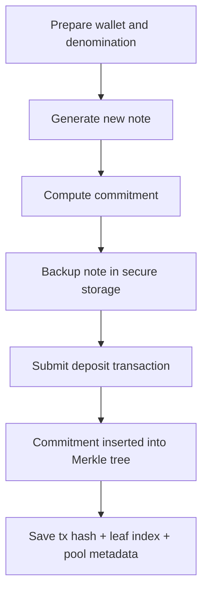
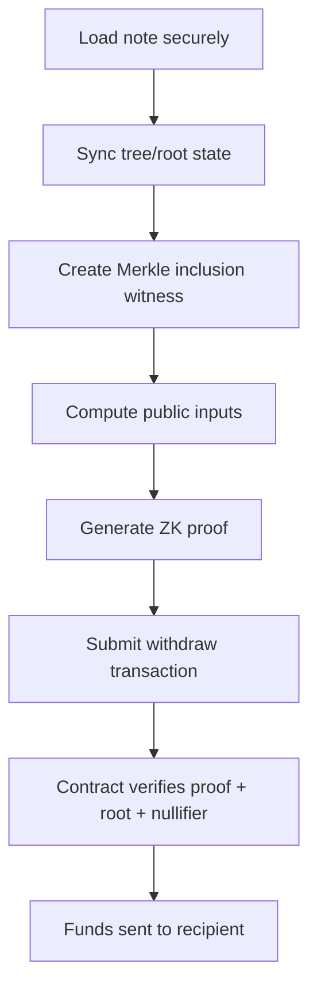

# PrivacyLayer User Guide

> Audience: users who want practical privacy on Stellar without needing deep cryptography knowledge.

## 1. Introduction

PrivacyLayer is a shielded pool for fixed-size deposits and withdrawals on Stellar Soroban. In simple terms, you put funds into a common pool and later withdraw to a different address using a zero-knowledge proof. The chain can verify the withdrawal is valid, but it cannot directly link your withdrawal to a specific deposit.

PrivacyLayer is designed around three ideas:

1. Fixed denominations reduce amount-based tracking.
2. Commitments and Merkle trees let the system prove membership without revealing secrets.
3. Nullifiers prevent double spends without exposing your original note.

Current contract capabilities (already implemented):

- Deposit into pool using a commitment.
- Withdraw with a Groth16 proof and public inputs.
- Root history checks for valid tree state.
- Nullifier checks to block repeat withdrawals.
- Admin controls (pause, unpause, verification key update).

Current product status:

- Smart contract and circuits are implemented.
- SDK/frontend are still evolving.
- The project is unaudited and not production-ready yet.

## 2. What PrivacyLayer Protects (and What It Does Not)

### What it helps protect

- Direct on-chain linkage between a specific deposit transaction and a later withdrawal transaction.
- Public exposure of your note secret and nullifier secret.
- Reuse-based double spends (via nullifier checks).

### What it does not fully protect

- Network metadata by itself (IP, timing, wallet behavior).
- Poor operational habits (immediate withdraw, repeated address reuse).
- Funds when a user loses note backup.
- Risks from unaudited smart contracts.

Treat PrivacyLayer as one layer in a privacy stack, not a full privacy guarantee by itself.

## 3. Getting Started

### 3.1 Prerequisites

Before your first deposit, prepare:

- A Stellar wallet (for example Freighter).
- Enough balance for the selected denomination + fees.
- A secure backup location for notes (offline password manager, encrypted vault, or hardware-backed storage).
- A second address to receive withdrawals (recommended for privacy separation).

### 3.2 Choose a Denomination

PrivacyLayer uses fixed buckets. At contract level, supported denominations are:

- `Xlm10`
- `Xlm100`
- `Xlm1000`
- `Usdc100`
- `Usdc1000`

Why this matters:

- Your deposit amount must match the pool denomination exactly.
- Your withdrawal amount is tied to that denomination (minus optional relayer fee).
- A larger anonymity set at the same denomination improves privacy.

### 3.3 Understand the Note Concept

A note is the secret material needed later for withdrawal proof generation.

At a high level, a note contains:

- A nullifier secret.
- A second secret value.
- A resulting commitment derived from hashing those secrets.
- Metadata you should keep (e.g., pool/denomination/network and deposit context).

If the note is lost, recovery is generally impossible.

## 4. Deposit Flow (Step by Step)

Use this checklist for deposits:

1. Confirm you are on the intended network and pool denomination.
2. Generate a fresh note (new secrets every time).
3. Back up the note before pressing confirm.
4. Submit the deposit commitment.
5. Wait for transaction finalization.
6. Save the returned leaf index/root context with your note backup.

### Deposit flow diagram

### Deposit do/don't

Do:

- Generate a brand-new note for every deposit.
- Back up immediately in at least two safe places.
- Keep a minimal metadata record (date, network, denomination, tx hash).

Do not:

- Share the note in chat/email/screenshots.
- Reuse old notes.
- Deposit if you cannot back up right away.

## 5. Withdrawal Flow (Step by Step)

Withdrawal requires a valid proof that your note corresponds to a commitment in the Merkle tree and that the nullifier is unused.

Checklist:

1. Retrieve your note securely.
2. Sync to a recent known Merkle root.
3. Choose recipient address (preferably different from deposit address).
4. Set relayer and fee only if needed.
5. Generate proof locally.
6. Submit withdrawal transaction.
7. Verify recipient balance update and archive the note as spent.

### Withdrawal flow diagram

### Fee and relayer behavior

- If fee is set, it must not exceed denomination amount.
- If relayer is set, fee must be non-zero.
- Recipient receives denomination minus fee.

## 6. Note Management (Critical)

This is the most important part of safe usage.

### 6.1 Backup strategy

Recommended minimum:

- One encrypted digital backup.
- One offline backup (for disaster recovery).
- A clear label with network and denomination.

Suggested backup record format:

- Note secret material (never plaintext in cloud notes).
- Network name.
- Pool denomination.
- Deposit tx hash.
- Deposit time.
- Optional leaf index/root at time of deposit.

### 6.2 Storage rules

- Encrypt at rest.
- Restrict access to only your trusted device/accounts.
- Avoid clipboard managers and auto-sync note apps for raw secrets.
- Never paste notes in support chats.

### 6.3 Lifecycle management

- Mark note as `unused` right after deposit.
- Mark as `spent` right after successful withdrawal.
- Keep spent-note records for accounting/audit, but never reuse.

## 7. Security Best Practices

### 7.1 Wallet hygiene

- Use strong wallet protection.
- Keep wallet software updated.
- Separate operational wallet and long-term holding wallet.

### 7.2 Address hygiene

- Prefer a new recipient address for withdrawals.
- Avoid withdrawing back to the same address used for deposit funding.
- Avoid repeating obvious user patterns.

### 7.3 Timing hygiene

- Do not always withdraw immediately after deposit.
- Randomize timing where possible.
- Larger anonymity sets generally improve privacy outcomes.

### 7.4 Environment hygiene

- Avoid untrusted devices/networks for note handling.
- Use a trusted browser profile.
- Minimize extension exposure when handling sensitive flows.

### 7.5 Operational checklist before every withdrawal

- Is this the correct network?
- Is the note definitely unused?
- Is recipient address correct and controlled by you?
- Is relayer fee reasonable?
- Did you verify note backup remains intact?

## 8. Privacy Considerations in Practice

Even with correct protocol usage, behavior can leak patterns. Keep these in mind:

- **Amount correlation**: fixed denomination helps, but unique behavior can still stand out.
- **Timing correlation**: close deposit/withdraw windows are easier to correlate.
- **Address clustering**: repeated address reuse weakens privacy.
- **Off-chain metadata**: device/network fingerprints can still reveal links.

Practical rule: combine protocol privacy with disciplined behavior.

## 9. Troubleshooting

Below are common failure modes and likely fixes.

### 9.1 NotInitialized

Meaning: pool setup is not complete.

What to do:

- Confirm the target contract is initialized.
- Verify you are using the expected deployed pool instance.

### 9.2 PoolPaused

Meaning: admin paused operations.

What to do:

- Wait for unpause announcement.
- Do not retry repeatedly; state won’t change from retries.

### 9.3 ZeroCommitment

Meaning: commitment generation failed or malformed input.

What to do:

- Regenerate note and commitment.
- Ensure secrets are not zero/default placeholders.

### 9.4 UnknownRoot

Meaning: provided root is not in root history window.

What to do:

- Resync tree state.
- Regenerate witness/proof against a known current root.

### 9.5 NullifierAlreadySpent

Meaning: this note was already used (or duplicate submission).

What to do:

- Check whether withdrawal already succeeded.
- Never attempt to reuse note.

### 9.6 InvalidProof

Meaning: proof and public inputs do not match contract expectations.

What to do:

- Rebuild witness from correct note + root + parameters.
- Check recipient/amount/fee/relayer encoding.
- Ensure proof was generated for the same circuit and VK.

### 9.7 FeeExceedsAmount or InvalidRelayerFee

Meaning: fee/relayer pair is invalid.

What to do:

- Keep fee <= denomination.
- If relayer is set, fee must be > 0.

### 9.8 InvalidRecipient

Meaning: recipient encoding or address is invalid.

What to do:

- Re-enter recipient address.
- Re-encode with expected format.

## 10. FAQ

### Q1: If I lose my note, can support recover my funds?

No. In privacy systems, note possession is effectively the right to withdraw. Without it, recovery is usually not possible.

### Q2: Can I withdraw a different amount than I deposited?

The system uses fixed denominations. Withdrawal amount follows pool denomination logic (minus optional fee).

### Q3: Is immediate withdrawal safe?

Technically valid, but weaker for privacy in many cases. Timing separation usually improves privacy.

### Q4: Why use a different recipient address?

Address separation helps reduce obvious links between funding and receiving wallets.

### Q5: Does PrivacyLayer hide everything?

No. It improves transaction unlinkability on-chain but does not automatically hide network metadata or poor opsec behavior.

### Q6: Can one note be used twice?

No. Nullifier checks are designed to block double spends.

### Q7: How do I know whether a withdrawal has already happened?

Track transaction results and maintain local note state (`unused` -> `spent`). If nullifier is marked spent, the note should be considered consumed.

### Q8: Is this production-safe today?

Not yet. The repository currently marks the system as unaudited. Treat usage as test or pre-production until audits are complete.

### Q9: Why fixed denominations?

They reduce direct amount-based linkability and simplify privacy set composition.

### Q10: Should I use a relayer every time?

Use relayer only when needed. If used, validate fee policy carefully.

## 11. Safe-Use Quick Checklist

Before deposit:

- [ ] Correct network and pool selected
- [ ] Fresh note generated
- [ ] Note backed up securely
- [ ] Denomination understood

Before withdrawal:

- [ ] Note is correct and unused
- [ ] Root is known/current
- [ ] Recipient address verified
- [ ] Fee/relayer configuration valid
- [ ] Proof generated from matching inputs

After withdrawal:

- [ ] Transaction confirmed
- [ ] Note marked as spent
- [ ] Record archived for your own tracking

## 12. References

- Contract API: `contracts/privacy_pool/src/contract.rs`
- Error definitions: `contracts/privacy_pool/src/types/errors.rs`
- Deposit flow: `contracts/privacy_pool/src/core/deposit.rs`
- Withdraw flow: `contracts/privacy_pool/src/core/withdraw.rs`
- Event model: `contracts/privacy_pool/src/types/events.rs`
- Project overview: `README.md`

---

If you are new to privacy systems: move slowly, verify every step, and prioritize secure note handling over speed.
