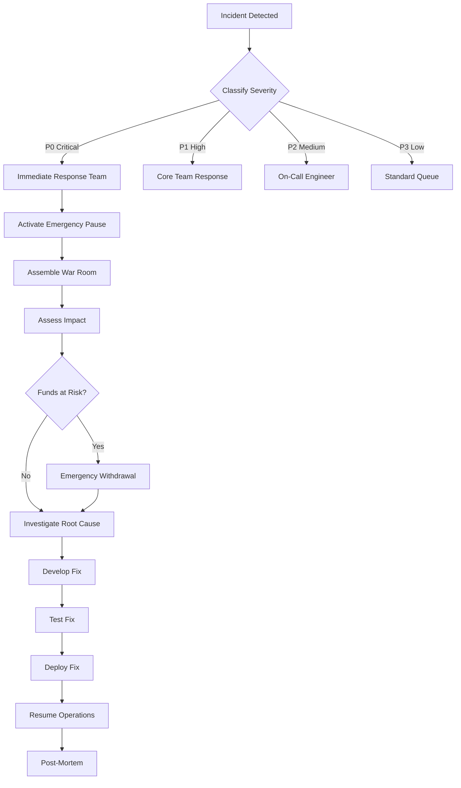

# 🛡️ PrivacyLayer Disaster Recovery Plan

> **Version:** 1.0 | **Last Updated:** 2026-03-22 | **Status:** 📋 Draft
>
> This document outlines comprehensive disaster recovery and business continuity procedures for PrivacyLayer.

---

## Table of Contents

1. [Executive Summary](#1-executive-summary)
2. [Risk Assessment](#2-risk-assessment)
3. [Recovery Procedures](#3-recovery-procedures)
4. [Backup Strategies](#4-backup-strategies)
5. [Communication Plan](#5-communication-plan)
6. [Testing Procedures](#6-testing-procedures)
7. [Roles and Responsibilities](#7-roles-and-responsibilities)
8. [Recovery Time Objectives](#8-recovery-time-objectives)
9. [Appendices](#9-appendices)

---

## 1. Executive Summary

### 1.1 Purpose

This Disaster Recovery Plan (DRP) provides a structured framework for responding to, recovering from, and mitigating the impact of disasters affecting PrivacyLayer's operations, infrastructure, and smart contracts on the Stellar network.

### 1.2 Scope

This plan covers:
- Smart contract incidents (exploits, bugs, vulnerabilities)
- Infrastructure failures (network, hosting, dependencies)
- Key management emergencies (compromised keys, lost access)
- Data integrity issues (Merkle tree corruption, state inconsistencies)
- Third-party service disruptions
- Natural disasters affecting operations

### 1.3 Recovery Objectives

| Metric | Target | Description |
|--------|--------|-------------|
| **RTO** (Recovery Time Objective) | 4 hours | Maximum time to restore core functionality |
| **RPO** (Recovery Point Objective) | 0 blocks | No data loss acceptable for blockchain state |
| **MTTR** (Mean Time To Recovery) | 2 hours | Average recovery time |
| **MTTD** (Mean Time To Detect) | 15 minutes | Maximum detection time for critical incidents |

---

## 2. Risk Assessment

### 2.1 Risk Matrix

| Risk Category | Likelihood | Impact | Risk Level | Priority |
|---------------|------------|--------|------------|----------|
| Smart Contract Exploit | Medium | Critical | 🔴 High | P1 |
| Cryptographic Vulnerability | Low | Critical | 🟠 Medium-High | P1 |
| Key Compromise | Low | Critical | 🟠 Medium-High | P1 |
| Network Congestion | Medium | Medium | 🟡 Medium | P2 |
| Infrastructure Failure | Low | High | 🟠 Medium-High | P2 |
| Third-Party Dependency Failure | Medium | Medium | 🟡 Medium | P2 |
| Regulatory Action | Low | High | 🟠 Medium-High | P2 |
| Insider Threat | Low | Critical | 🟠 Medium-High | P1 |
| Natural Disaster | Low | Medium | 🟢 Low | P3 |

### 2.2 Detailed Risk Analysis

#### 2.2.1 Smart Contract Exploit

| Attribute | Details |
|-----------|---------|
| **Risk ID** | R-001 |
| **Category** | Technical |
| **Description** | Vulnerability in Soroban smart contract code leading to unauthorized fund access or loss |
| **Likelihood** | Medium - Complex ZK circuit and contract logic |
| **Impact** | Critical - Total loss of user funds, reputation damage |
| **Attack Vectors** | Reentrancy, logic errors, overflow/underflow, access control bypass |
| **Current Mitigations** | Audits planned, testnet testing, bug bounty |
| **Residual Risk** | Medium - Requires formal verification |
| **Recovery Strategy** | Emergency pause, fund recovery, contract upgrade |

#### 2.2.2 Cryptographic Vulnerability

| Attribute | Details |
|-----------|---------|
| **Risk ID** | R-002 |
| **Category** | Technical |
| **Description** | Vulnerability in BN254, Poseidon, or ZK circuit implementation |
| **Likelihood** | Low - Using battle-tested Protocol 25 primitives |
| **Impact** | Critical - Privacy guarantees broken, funds at risk |
| **Attack Vectors** | Curve attacks, hash collisions, proof forgery |
| **Current Mitigations** | Using native Stellar primitives, planned ZK audit |
| **Residual Risk** | Low - Protocol primitives well-tested |
| **Recovery Strategy** | Circuit upgrade, re-deposit campaign |

#### 2.2.3 Key Compromise

| Attribute | Details |
|-----------|---------|
| **Risk ID** | R-003 |
| **Category** | Operational |
| **Description** | Unauthorized access to admin or deployer private keys |
| **Likelihood** | Low - Multi-sig implementation |
| **Impact** | Critical - Complete protocol takeover |
| **Attack Vectors** | Phishing, hardware wallet compromise, insider threat |
| **Current Mitigations** | 3-of-5 multi-sig for admin, hardware wallets |
| **Residual Risk** | Low - Multi-sig provides protection |
| **Recovery Strategy** | Emergency admin transfer, key rotation |

#### 2.2.4 Network Congestion

| Attribute | Details |
|-----------|---------|
| **Risk ID** | R-004 |
| **Category** | External |
| **Description** | Stellar network congestion preventing timely transactions |
| **Likelihood** | Medium - Depends on network activity |
| **Impact** | Medium - Delayed deposits/withdrawals, user frustration |
| **Attack Vectors** | Network spam, high demand periods |
| **Current Mitigations** | None - Network-level issue |
| **Residual Risk** | Medium - Uncontrollable |
| **Recovery Strategy** | Transaction queuing, user communication |

#### 2.2.5 Infrastructure Failure

| Attribute | Details |
|-----------|---------|
| **Risk ID** | R-005 |
| **Category** | Technical |
| **Description** | Failure of critical infrastructure (SDK servers, monitoring, backup systems) |
| **Likelihood** | Low - Redundant systems planned |
| **Impact** | High - Service disruption, inability to monitor |
| **Attack Vectors** | Server failure, DDoS, cloud provider outage |
| **Current Mitigations** | Multi-region deployment planned |
| **Residual Risk** | Low |
| **Recovery Strategy** | Failover systems, backup restoration |

#### 2.2.6 Third-Party Dependency Failure

| Attribute | Details |
|-----------|---------|
| **Risk ID** | R-006 |
| **Category** | External |
| **Description** | Failure or compromise of third-party services (Noir, Stellar SDKs) |
| **Likelihood** | Medium - Dependencies update frequently |
| **Impact** | Medium - Build failures, security vulnerabilities |
| **Attack Vectors** | Supply chain attack, maintainer compromise |
| **Current Mitigations** | Dependency pinning, audit planned |
| **Residual Risk** | Medium |
| **Recovery Strategy** | Version rollback, alternative implementations |

#### 2.2.7 Regulatory Action

| Attribute | Details |
|-----------|---------|
| **Risk ID** | R-007 |
| **Category** | Compliance |
| **Description** | Regulatory action requiring service modification or shutdown |
| **Likelihood** | Low - Privacy tools face scrutiny |
| **Impact** | High - Operational restrictions, legal costs |
| **Attack Vectors** | Government action, regulatory changes |
| **Current Mitigations** | Legal review, compliance-forward design |
| **Residual Risk** | Medium |
| **Recovery Strategy** | Legal response, compliance modification, graceful shutdown |

#### 2.2.8 Insider Threat

| Attribute | Details |
|-----------|---------|
| **Risk ID** | R-008 |
| **Category** | Operational |
| **Description** | Malicious action by team member with privileged access |
| **Likelihood** | Low |
| **Impact** | Critical - Fund theft, protocol sabotage |
| **Attack Vectors** | Key theft, code backdoors, information leak |
| **Current Mitigations** | Multi-sig controls, code review process |
| **Residual Risk** | Low |
| **Recovery Strategy** | Access revocation, forensic analysis, legal action |

#### 2.2.9 Natural Disaster

| Attribute | Details |
|-----------|---------|
| **Risk ID** | R-009 |
| **Category** | External |
| **Description** | Natural disaster affecting team members or data centers |
| **Likelihood** | Low |
| **Impact** | Medium - Operational disruption |
| **Attack Vectors** | Earthquake, flood, fire, pandemic |
| **Current Mitigations** | Distributed team, cloud infrastructure |
| **Residual Risk** | Low |
| **Recovery Strategy** | Team safety first, remote operations activation |

---

## 3. Recovery Procedures

### 3.1 Incident Classification

| Severity | Code | Description | Response Time | Examples |
|----------|------|-------------|---------------|----------|
| **Critical** | P0 | Active exploit, funds at risk | <15 minutes | Ongoing attack, key compromise |
| **High** | P1 | Significant vulnerability found | <1 hour | Bug with fund loss potential |
| **Medium** | P2 | Service degradation | <4 hours | Network congestion, minor bugs |
| **Low** | P3 | Minor issues | <24 hours | UI glitches, documentation errors |

### 3.2 Incident Response Flowchart



### 3.3 Recovery Procedures by Scenario

#### 3.3.1 Smart Contract Exploit (P0)

**Trigger:** Active exploit detected or reported

| Step | Action | Owner | Time | Verification |
|------|--------|-------|------|--------------|
| 1 | Detect anomaly | Monitoring/Audit | T+0 | Alert triggered |
| 2 | Verify exploit | Security Lead | T+5min | Confirmed active |
| 3 | **PAUSE CONTRACT** | Multi-sig signer | T+10min | `pause()` called |
| 4 | Notify team | Incident Commander | T+10min | All-hands alert |
| 5 | Assess fund exposure | Tech Lead | T+15min | TVL at risk |
| 6 | Document evidence | Security Lead | T+30min | Screenshots, txs |
| 7 | Determine response strategy | Core Team | T+1h | Fix vs emergency |
| 8 | Execute recovery plan | Tech Lead | T+2h | Per decision |
| 9 | Communicate to users | Comms Lead | T+2h | Status page update |
| 10 | Post-incident review | All | T+24h | Lessons learned |

**Pause Command:**
```bash
# Requires 3-of-5 multi-sig approval
stellar contract invoke --id <CONTRACT_ID> -- pause --source <multisig-account>

# Verify pause active
stellar contract invoke --id <CONTRACT_ID> -- is_paused
```

#### 3.3.2 Key Compromise (P0)

**Trigger:** Suspected or confirmed key compromise

| Step | Action | Owner | Time | Verification |
|------|--------|-------|------|--------------|
| 1 | Confirm compromise | Security Lead | T+0 | Evidence gathered |
| 2 | **REVOKE ACCESS** | Multi-sig signers | T+5min | Remove compromised key |
| 3 | Generate new key | Security Lead | T+15min | New key pair |
| 4 | Transfer admin | Remaining signers | T+30min | New admin set |
| 5 | Audit recent actions | Tech Lead | T+1h | No unauthorized changes |
| 6 | Notify stakeholders | Incident Commander | T+1h | Team + users |
| 7 | Rotate all credentials | Security Lead | T+2h | Full rotation |
| 8 | Document incident | Security Lead | T+4h | Full report |
| 9 | Update procedures | Ops Lead | T+24h | Prevent recurrence |

**Key Rotation Commands:**
```bash
# 1. Remove compromised signer (requires remaining valid signers)
stellar contract invoke --id <CONTRACT_ID> -- remove_signer <compromised_address>

# 2. Add new signer
stellar contract invoke --id <CONTRACT_ID> -- add_signer <new_address>

# 3. Verify new configuration
stellar contract invoke --id <CONTRACT_ID> -- get_signers
```

#### 3.3.3 Cryptographic Vulnerability (P0/P1)

**Trigger:** Vulnerability discovered in BN254, Poseidon, or circuits

| Step | Action | Owner | Time | Verification |
|------|--------|-------|------|--------------|
| 1 | Assess severity | Crypto Lead | T+0 | Impact analysis |
| 2 | **PAUSE if critical** | Multi-sig | T+1h | If active exploit risk |
| 3 | Notify Stellar Foundation | Crypto Lead | T+2h | Protocol-level issue? |
| 4 | Develop patch | Circuit Team | T+24h | Fix vulnerability |
| 5 | Audit patch | External Auditor | T+1week | Third-party review |
| 6 | Deploy new circuits | DevOps | T+2weeks | Migration plan |
| 7 | Communicate to users | Comms Lead | Ongoing | Transparency |

**Circuit Upgrade Process:**
```bash
# 1. Deploy new verifier contract
stellar contract deploy --wasm <new-verifier.wasm> --source <deployer>

# 2. Update contract reference (if upgradable)
stellar contract invoke --id <CONTRACT_ID> -- update_verifier <new-verifier-id>

# 3. Verify new verifier
stellar contract invoke --id <CONTRACT_ID> -- get_verifier
```

#### 3.3.4 Infrastructure Failure (P1/P2)

**Trigger:** Service disruption, server failure

| Step | Action | Owner | Time | Verification |
|------|--------|-------|------|--------------|
| 1 | Detect failure | Monitoring | T+0 | Alert triggered |
| 2 | Assess scope | DevOps | T+5min | Components affected |
| 3 | Activate backup systems | DevOps | T+15min | Failover |
| 4 | Diagnose root cause | DevOps | T+30min | Error logs |
| 5 | Implement fix | DevOps | T+1h | Patch/rollback |
| 6 | Restore primary systems | DevOps | T+4h | Full recovery |
| 7 | Update status page | Comms | Ongoing | User communication |
| 8 | Post-incident review | All | T+24h | Lessons learned |

**Failover Checklist:**
```bash
# SDK Server Failover
# 1. Verify backup server health
curl https://backup.privacylayer.io/health

# 2. Update DNS to point to backup
# (DNS provider specific)

# 3. Verify services running
stellar contract invoke --id <CONTRACT_ID> -- get_config --rpc-url <backup-rpc>

# 4. Monitor traffic
# (Monitoring dashboard)
```

#### 3.3.5 Data Integrity Issue (P1)

**Trigger:** Merkle tree corruption, state inconsistency detected

| Step | Action | Owner | Time | Verification |
|------|--------|-------|------|--------------|
| 1 | Detect inconsistency | Monitoring | T+0 | State mismatch |
| 2 | **PAUSE operations** | Multi-sig | T+5min | Prevent further corruption |
| 3 | Identify affected data | Tech Lead | T+30min | Scope determination |
| 4 | Rebuild from chain | Tech Lead | T+2h | Regenerate Merkle tree |
| 5 | Verify reconstruction | Tech Lead | T+3h | Match on-chain state |
| 6 | Resume operations | Multi-sig | T+4h | Unpause contract |
| 7 | Audit integrity | Security Lead | T+24h | Full audit |

**Merkle Tree Reconstruction:**
```typescript
// Rebuild Merkle tree from on-chain events
async function reconstructMerkleTree(): Promise<MerkleTree> {
  const events = await fetchAllDepositEvents();
  const leaves = events.map(e => e.commitment);
  const tree = new MerkleTree(MERKLE_DEPTH, leaves);
  
  // Verify against on-chain root
  const onChainRoot = await contract.get_merkle_root();
  if (tree.root !== onChainRoot) {
    throw new Error('Reconstruction mismatch');
  }
  
  return tree;
}
```

### 3.4 Emergency Withdrawal Procedure

**Only executed when:**
- Contract is irreparably compromised
- Recovery is impossible or impractical
- Approved by 4-of-5 multi-sig signers

| Step | Action | Owner | Verification |
|------|--------|-------|--------------|
| 1 | Document situation | Tech Lead | Full incident report |
| 2 | Multi-sig vote | Signers | 4-of-5 approval required |
| 3 | Execute emergency withdrawal | Tech Lead | Call `emergency_withdraw()` |
| 4 | Verify fund distribution | Tech Lead | All users can claim |
| 5 | Publish incident report | Comms Lead | Full transparency |
| 6 | Coordinate user claims | Support | Help users recover funds |

**Emergency Withdrawal Contract Call:**
```bash
# Requires 4-of-5 multi-sig approval
stellar contract invoke --id <CONTRACT_ID> -- emergency_withdraw --source <multisig-account>

# This will:
# 1. Pause all operations
# 2. Enable claim mode
# 3. Users can withdraw based on their deposit records
```

---

## 4. Backup Strategies

### 4.1 Data Backup Categories

| Category | Data Type | Backup Frequency | Retention | Location |
|----------|-----------|------------------|-----------|----------|
| **On-Chain State** | Contract storage, Merkle tree | Real-time | Permanent | Stellar ledger |
| **Off-Chain Index** | Deposit/withdrawal events | Hourly | 1 year | Multi-region DB |
| **Configuration** | Admin keys, parameters | Daily | 90 days | Encrypted vault |
| **Documentation** | Incident logs, procedures | Daily | 3 years | Cloud storage |
| **Code** | Smart contracts, circuits | Per release | Permanent | GitHub, IPFS |
| **Keys** | Multi-sig backups | Monthly | Indefinite | Hardware vaults |

### 4.2 Backup Implementation

#### 4.2.1 On-Chain Data (Stellar Ledger)

```bash
# No backup needed - data is permanent on blockchain
# Recovery: Query stellar horizon for historical data

# Example: Fetch all deposit events
stellar events --id <CONTRACT_ID> --topic deposit --start-ledger <START>
```

#### 4.2.2 Off-Chain Index Database

```yaml
# backup-config.yaml
database:
  primary: postgresql://primary.privacylayer.io
  replica: postgresql://replica.privacylayer.io
  
backup:
  schedule: "0 * * * *"  # Hourly
  retention_days: 365
  storage:
    - s3://privacylayer-backups/db/
    - gcs://privacylayer-backups/db/  # Cross-cloud redundancy
  
encryption:
  algorithm: AES-256-GCM
  key_vault: hashicorp-vault://privacylayer/db-backup-key
```

**Backup Script:**
```bash
#!/bin/bash
# hourly-backup.sh

TIMESTAMP=$(date +%Y%m%d_%H%M%S)
BACKUP_FILE="privacylayer_${TIMESTAMP}.sql.gz"

# Create backup
pg_dump -h $DB_HOST -U $DB_USER privacylayer | gzip > $BACKUP_FILE

# Encrypt
openssl enc -aes-256-gcm -salt -pbkdf2 -in $BACKUP_FILE -out "${BACKUP_FILE}.enc" -pass file:/vault/db-backup-key

# Upload to multiple clouds
aws s3 cp "${BACKUP_FILE}.enc" "s3://privacylayer-backups/db/${BACKUP_FILE}.enc"
gsutil cp "${BACKUP_FILE}.enc" "gs://privacylayer-backups/db/${BACKUP_FILE}.enc"

# Cleanup
rm $BACKUP_FILE "${BACKUP_FILE}.enc"

echo "Backup completed: ${TIMESTAMP}"
```

#### 4.2.3 Configuration Backup

```yaml
# config-backup.yaml
config_sources:
  - type: contract_parameters
    contract_id: CXXXXXXXXXXXXXXXXXXXXXXXX
    fetch_interval: daily
    
  - type: admin_keys
    storage: hashicorp-vault
    path: secret/privacylayer/admin-keys
    
  - type: circuit_params
    location: ipfs://QmXXX... + github release

backup_schedule:
  frequency: daily
  retention_days: 90
  destinations:
    - s3://privacylayer-backups/config/
    - encrypted-volume:/config-backups/
```

#### 4.2.4 Code Backup

```bash
# All code is backed up via:
# 1. GitHub (primary) - all releases tagged
# 2. IPFS (circuits) - pinned on release
# 3. Local mirrors - team member repos

# Verify code backup
gh release list --repo ANAVHEOBA/PrivacyLayer

# IPFS circuit backup
ipfs pin ls | grep privacylayer
```

#### 4.2.5 Key Backup

| Key Type | Storage | Backup Method | Recovery Time |
|----------|---------|----------------|---------------|
| Admin Multi-Sig | Hardware wallets (5) | Seed phrase in steel plates, distributed | 24-48 hours |
| Deployer Key | Hardware wallet | Seed phrase in steel plate, vault storage | 24-48 hours |
| SDK Server Keys | HSM/Cloud KMS | Key rotation capability | 1 hour |
| Monitoring Keys | Encrypted vault | Automated backup | 4 hours |

**Key Backup Locations:**
```
Hardware Wallets (5 signers):
├── Signer 1: Safe deposit box, Bank A, NYC
├── Signer 2: Home safe, Signer A residence
├── Signer 3: Safe deposit box, Bank B, LA
├── Signer 4: Home safe, Signer B residence
└── Signer 5: Secure facility, Lawyer office

Seed Phrase Backups (Steel Plates):
├── Primary: Bank vault, NYC
├── Secondary: Bank vault, LA
└── Tertiary: Lawyer office (sealed envelope)
```

### 4.3 Backup Verification

| Verification Type | Frequency | Method |
|-------------------|-----------|--------|
| Database Restore Test | Monthly | Restore to test environment, verify integrity |
| Key Recovery Drill | Quarterly | Practice key recovery with backup materials |
| Configuration Restore | Quarterly | Restore config to staging, verify parameters |
| Code Deployment | Per release | Deploy from backup to testnet |
| Full DR Drill | Annually | Complete disaster simulation |

**Verification Checklist:**
```bash
# Monthly database verification
./scripts/verify-backup.sh

#!/bin/bash
# verify-backup.sh

# 1. Download latest backup
LATEST=$(aws s3 ls s3://privacylayer-backups/db/ | sort | tail -1 | awk '{print $4}')
aws s3 cp "s3://privacylayer-backups/db/${LATEST}" /tmp/backup.sql.gz.enc

# 2. Decrypt
openssl enc -d -aes-256-gcm -pbkdf2 -in /tmp/backup.sql.gz.enc -out /tmp/backup.sql.gz -pass file:/vault/db-backup-key

# 3. Restore to test database
gunzip -c /tmp/backup.sql.gz | psql -h test-db privacylayer_test

# 4. Verify integrity
psql -h test-db privacylayer_test -c "SELECT COUNT(*) FROM deposits;"
psql -h test-db privacylayer_test -c "SELECT COUNT(*) FROM withdrawals;"

# 5. Verify against on-chain
./scripts/verify-on-chain.sh test-db

echo "Backup verification complete"
```

### 4.4 Recovery from Backup

#### 4.4.1 Database Recovery

```bash
#!/bin/bash
# recover-database.sh

# 1. Identify backup to restore
echo "Available backups:"
aws s3 ls s3://privacylayer-backups/db/ | sort -r | head -10

read -p "Enter backup filename: " BACKUP_FILE

# 2. Download backup
aws s3 cp "s3://privacylayer-backups/db/${BACKUP_FILE}" /tmp/recovery.sql.gz.enc

# 3. Decrypt
openssl enc -d -aes-256-gcm -pbkdf2 -in /tmp/recovery.sql.gz.enc -out /tmp/recovery.sql.gz -pass file:/vault/db-backup-key

# 4. Stop application
systemctl stop privacylayer-sdk

# 5. Restore database
gunzip -c /tmp/recovery.sql.gz | psql -h $DB_HOST -U $DB_USER privacylayer

# 6. Verify
psql -h $DB_HOST -U $DB_USER privacylayer -c "SELECT COUNT(*) FROM deposits;"

# 7. Start application
systemctl start privacylayer-sdk

# 8. Verify sync
curl http://localhost:3000/health

echo "Database recovery complete"
```

#### 4.4.2 Key Recovery

```bash
#!/bin/bash
# recover-key.sh

# Hardware wallet recovery
# 1. Obtain seed phrase from backup location
# 2. Initialize new hardware wallet
# 3. Restore from seed phrase

# Example: Ledger recovery
echo "Key Recovery Procedure:"
echo "1. Retrieve seed phrase from vault location"
echo "2. Initialize new Ledger device"
echo "3. Select 'Restore from recovery phrase'"
echo "4. Enter seed phrase (24 words)"
echo "5. Verify correct address derivation"
echo "6. Transfer admin rights from old to new key"

# For multi-sig rotation:
# stellar contract invoke --id <CONTRACT_ID> -- remove_signer <old-address> -- add_signer <new-address>
```

---

## 5. Communication Plan

### 5.1 Communication Channels

| Channel | Purpose | Audience | Response Time |
|---------|---------|----------|---------------|
| **Status Page** | status.privacylayer.io | Public | Real-time updates |
| **Twitter/X** | @PrivacyLayer | Public | Updates every 30 min during incidents |
| **Discord** | discord.gg/privacylayer | Community | Real-time support |
| **Telegram** | t.me/privacylayer | Community | Announcements |
| **Email** | security@privacylayer.io | Security reports | 24h response |
| **Internal Slack** | #incident-response | Team | Immediate |

### 5.2 Stakeholder Communication Matrix

| Stakeholder | Contact Method | Update Frequency | Responsible |
|-------------|----------------|------------------|-------------|
| Core Team | Slack + Phone | Immediate | Incident Commander |
| Multi-sig Signers | Signal | Within 15 min | Security Lead |
| Users | Status Page + Twitter | Every 30 min during incident | Comms Lead |
| Stellar Foundation | Email | Within 1 hour | Tech Lead |
| Auditors | Email | Within 24 hours | Security Lead |
| Media | Press Release | As needed | Comms Lead |
| Regulators | Official channels | As required | Legal |

### 5.3 Incident Communication Templates

#### 5.3.1 Initial Incident Alert (Internal)

```markdown
🚨 INCIDENT ALERT 🚨

**Incident ID:** INC-YYYY-MM-DD-###
**Severity:** P0/P1/P2/P3
**Status:** DETECTED
**Time Detected:** [UTC Timestamp]
**Detected By:** [Source]

**Summary:**
[1-2 sentence description of the incident]

**Impact:**
- Users affected: [Number/Unknown]
- Funds at risk: [Yes/No/Amount]
- Services affected: [List]

**Current Actions:**
1. [Action being taken]
2. [Next action]

**Next Update:** [Time UTC]

**Incident Commander:** [Name]
**War Room:** [Link/Channel]
```

#### 5.3.2 Public Status Update (P0/P1)

```markdown
⚠️ PRIVACYLAYER SERVICE ALERT ⚠️

**Status:** INVESTIGATING / IDENTIFIED / MONITORING / RESOLVED
**Started:** [UTC Timestamp]
**Impact:** [Description of user-facing impact]

**Details:**
We are currently investigating an issue affecting [service]. Our team is actively working on a resolution.

**What you need to know:**
- [User action required, if any]
- [Current status of funds]

**Next Update:** [Time UTC]
**Status Page:** https://status.privacylayer.io

We will provide updates every 30 minutes.
```

#### 5.3.3 Resolution Notice

```markdown
✅ PRIVACYLAYER INCIDENT RESOLVED ✅

**Incident ID:** INC-YYYY-MM-DD-###
**Duration:** [Total time]
**Status:** RESOLVED

**Summary:**
[Brief description of the incident and resolution]

**Impact:**
- Duration: [Total time]
- Users affected: [Number]
- Funds status: [Safe/Amount affected]

**Root Cause:**
[Brief explanation, if determined]

**What we did:**
1. [Action taken]
2. [Action taken]

**What's next:**
- Post-mortem will be published at [URL] within 72 hours
- [Preventive measures planned]

Thank you for your patience during this incident.

**Status Page:** https://status.privacylayer.io
```

#### 5.3.4 Security Advisory (Post-Incident)

```markdown
🔒 PRIVACYLAYER SECURITY ADVISORY 🔒

**Advisory ID:** PLA-YYYY-###
**Severity:** Critical/High/Medium/Low
**Published:** [UTC Timestamp]

**Summary:**
[Description of the vulnerability or issue]

**Affected Versions:**
- [Version range]

**Fixed Versions:**
- [Version with fix]

**Technical Details:**
[Detailed technical explanation]

**Mitigation:**
[Steps users should take, if any]

**Credits:**
[If applicable, credit security researcher]

**References:**
- [Link to post-mortem]
- [Link to fix PR]
```

### 5.4 Communication Timeline by Severity

#### P0 - Critical (Funds at Risk)

| Time | Action | Channel | Template |
|------|--------|---------|----------|
| T+0 | Internal alert | Slack | Initial Incident Alert |
| T+5min | Pause contract | On-chain | N/A |
| T+10min | Public status update | Status Page, Twitter | Status Update |
| T+30min | Detailed update | Status Page, Twitter | Status Update |
| T+1h | Hourly update | All channels | Status Update |
| ... | Continue every hour | All channels | Status Update |
| Resolution | Resolution notice | All channels | Resolution Notice |
| T+72h | Post-mortem | Blog | Full report |

#### P1 - High (Vulnerability Found, No Active Exploit)

| Time | Action | Channel | Template |
|------|--------|---------|----------|
| T+0 | Internal alert | Slack | Initial Incident Alert |
| T+1h | Public disclosure (if appropriate) | Status Page | Status Update |
| T+24h | Progress update | Status Page | Status Update |
| Resolution | Resolution notice | All channels | Resolution Notice |
| T+7d | Security advisory | Blog | Security Advisory |

#### P2 - Medium (Service Degradation)

| Time | Action | Channel | Template |
|------|--------|---------|----------|
| T+0 | Internal alert | Slack | Initial Incident Alert |
| T+1h | Public status (if user-facing) | Status Page | Status Update |
| T+4h | Resolution update | Status Page | Status Update |
| Resolution | Resolution notice | Status Page | Resolution Notice |

#### P3 - Low (Minor Issues)

| Time | Action | Channel | Template |
|------|--------|---------|----------|
| T+0 | Internal ticket | Jira | N/A |
| Resolution | Update ticket | Jira | N/A |

---

## 6. Testing Procedures

### 6.1 Testing Schedule

| Test Type | Frequency | Scope | Duration | Participants |
|-----------|-----------|-------|----------|--------------|
| **Tabletop Exercise** | Monthly | Scenario discussion | 2 hours | Core team |
| **Functional DR Test** | Quarterly | Backup restoration | 4 hours | DevOps, Tech Lead |
| **Key Recovery Drill** | Quarterly | Key recovery | 2 hours | Multi-sig signers |
| **Full DR Simulation** | Annually | Complete failover | 8 hours | All team |
| **Penetration Test** | Annually | Security testing | 2 weeks | External firm |

### 6.2 Test Scenarios

#### 6.2.1 Scenario 1: Smart Contract Exploit (Tabletop)

**Objective:** Test response procedures for an active exploit

**Duration:** 2 hours

**Participants:** Core team, multi-sig signers

**Scenario Description:**
```
Day: Saturday, 2:00 AM UTC
Alert: Monitoring detects unusual withdrawal pattern - 10x normal volume
Status: Contract is being drained, ~50,000 XLM at risk

Discussion Points:
1. How do you verify this is an exploit?
2. What is the immediate response?
3. Who needs to be notified?
4. How do you pause the contract?
5. How do you assess the damage?
6. What communication goes out to users?
7. What is the recovery plan?
```

**Evaluation Criteria:**
- [ ] Decision to pause made within 15 minutes
- [ ] All stakeholders notified within 30 minutes
- [ ] Communication drafted and approved within 1 hour
- [ ] Root cause investigation plan established
- [ ] Recovery options documented

#### 6.2.2 Scenario 2: Key Compromise (Functional)

**Objective:** Validate key recovery and rotation procedures

**Duration:** 2 hours

**Participants:** Multi-sig signers, Security Lead

**Procedure:**
```bash
# 1. Simulate key compromise detection
echo "Simulating key compromise of signer 3"

# 2. Execute removal of compromised signer
# (On testnet)
stellar contract invoke --id <TESTNET_CONTRACT> -- remove_signer <test-address>

# 3. Add new signer
stellar contract invoke --id <TESTNET_CONTRACT> -- add_signer <new-test-address>

# 4. Verify new configuration
stellar contract invoke --id <TESTNET_CONTRACT> -- get_signers

# 5. Test new signer can approve transactions
stellar contract invoke --id <TESTNET_CONTRACT> -- pause --source <new-signer>
```

**Success Criteria:**
- [ ] Compromised signer removed within 30 minutes
- [ ] New signer added within 45 minutes
- [ ] All functions work with new configuration
- [ ] Documentation updated

#### 6.2.3 Scenario 3: Database Failure (Functional)

**Objective:** Validate database backup and recovery

**Duration:** 4 hours

**Participants:** DevOps, Tech Lead

**Procedure:**
```bash
# 1. Simulate database failure
docker stop privacylayer-db

# 2. Verify monitoring alerts
curl http://monitoring.local/alerts

# 3. Initiate recovery procedure
./scripts/recover-database.sh

# 4. Verify data integrity
./scripts/verify-on-chain.sh

# 5. Resume operations
systemctl restart privacylayer-sdk

# 6. Verify service health
curl https://sdk.privacylayer.io/health
```

**Success Criteria:**
- [ ] Monitoring detected failure within 5 minutes
- [ ] Recovery initiated within 30 minutes
- [ ] Database restored within 2 hours
- [ ] Data integrity verified
- [ ] Service restored within 4 hours

#### 6.2.4 Scenario 4: Full Failover (Annual Simulation)

**Objective:** Complete disaster recovery test

**Duration:** 8 hours

**Participants:** All team members

**Procedure:**
```
Phase 1: Incident Declaration (0:00 - 0:30)
- Simulate catastrophic infrastructure failure
- Activate incident response team
- Establish war room

Phase 2: Initial Response (0:30 - 1:30)
- Pause contract operations
- Assess situation scope
- Begin communication

Phase 3: Recovery Execution (1:30 - 4:00)
- Restore database from backup
- Deploy to backup infrastructure
- Verify all systems

Phase 4: Resumption (4:00 - 6:00)
- Resume contract operations
- Verify all functions
- Monitor for issues

Phase 5: Communication (6:00 - 7:00)
- Issue resolution notices
- Update all stakeholders
- Document timeline

Phase 6: Debrief (7:00 - 8:00)
- Identify gaps
- Update procedures
- Document lessons learned
```

**Success Criteria:**
- [ ] All systems operational within RTO (4 hours)
- [ ] No data loss (RPO = 0)
- [ ] Communication completed per plan
- [ ] All team members knew their roles

### 6.3 Test Documentation

#### Test Report Template

```markdown
# Disaster Recovery Test Report

**Test ID:** DRT-YYYY-MM-DD-###
**Test Type:** [Tabletop/Functional/Simulation]
**Date:** [Date]
**Duration:** [Hours]
**Participants:** [List]

## Summary
[2-3 sentence summary of the test]

## Objectives
1. [Objective 1]
2. [Objective 2]

## Scenario
[Description of scenario tested]

## Timeline
| Time | Action | Result |
|------|--------|--------|
| [Time] | [Action] | [Success/Failure] |

## Findings

### What Worked Well
- [Finding 1]
- [Finding 2]

### Issues Identified
- [Issue 1]
- [Issue 2]

### Recommendations
- [Recommendation 1]
- [Recommendation 2]

## Metrics

| Metric | Target | Actual | Status |
|--------|--------|--------|--------|
| Response Time | 15 min | [Actual] | [Pass/Fail] |
| Recovery Time | 4 hours | [Actual] | [Pass/Fail] |
| Data Loss | 0 | [Actual] | [Pass/Fail] |

## Action Items

| ID | Action | Owner | Due Date | Status |
|----|--------|-------|----------|--------|
| 1 | [Action] | [Name] | [Date] | [Status] |

## Sign-off

| Role | Name | Date |
|------|------|------|
| Test Lead | | |
| Tech Lead | | |
| Security Lead | | |
```

### 6.4 Continuous Improvement

| Activity | Frequency | Owner | Output |
|----------|-----------|-------|--------|
| Post-incident review | After each incident | Security Lead | Incident report |
| DR test analysis | After each test | DevOps | Test report |
| Procedure updates | Quarterly | Tech Lead | Updated DRP |
| Training sessions | Quarterly | All | Team readiness |
| External audit | Annually | External | Audit report |

---

## 7. Roles and Responsibilities

### 7.1 Incident Response Team

| Role | Responsibilities | Primary | Backup |
|------|------------------|---------|--------|
| **Incident Commander** | Overall coordination, decision authority | Tech Lead | Ops Lead |
| **Technical Lead** | Technical response, system recovery | [Name] | [Name] |
| **Security Lead** | Security assessment, forensics | [Name] | [Name] |
| **Communications Lead** | User/stakeholder communication | [Name] | [Name] |
| **DevOps Lead** | Infrastructure recovery | [Name] | [Name] |
| **Legal/Compliance** | Regulatory, legal guidance | [Name] | [Name] |

### 7.2 Decision Authority Matrix

| Decision | Authority | Backup Authority |
|----------|-----------|-------------------|
| Pause contract | 1 multi-sig signer + Incident Commander | 2 multi-sig signers |
| Emergency withdrawal | 4-of-5 multi-sig signers | N/A |
| Resume operations | Incident Commander + Tech Lead | Multi-sig majority |
| Public communication | Communications Lead + Incident Commander | Tech Lead |
| Contact regulators | Legal + Incident Commander | CEO |
| Engage external help | Incident Commander | Tech Lead |

### 7.3 On-Call Rotation

| Tier | Response Time | Coverage | Responsibilities |
|------|---------------|----------|------------------|
| Tier 1 (Primary) | <15 minutes | 24/7 | Initial response, escalation |
| Tier 2 (Secondary) | <30 minutes | 24/7 | Technical deep-dive |
| Tier 3 (Management) | <1 hour | Business hours | Executive decisions |

### 7.4 External Contacts

| Contact | Role | Phone | Email | Response Time |
|---------|------|-------|-------|---------------|
| Stellar Foundation | Protocol issues | - | security@stellar.org | 24 hours |
| Auditor (TBD) | Security consultation | - | - | 48 hours |
| Legal Counsel | Legal advice | - | - | 24 hours |
| Insurance (if applicable) | Claims | - | - | 72 hours |
| Law Enforcement | Criminal activity | Local | - | As needed |

---

## 8. Recovery Time Objectives

### 8.1 RTO by Scenario

| Scenario | RTO | RPO | Priority |
|----------|-----|-----|----------|
| Active exploit | 15 min | 0 blocks | P0 |
| Key compromise | 30 min | 0 blocks | P0 |
| Contract bug | 4 hours | 0 blocks | P1 |
| Infrastructure failure | 4 hours | <1 hour | P1 |
| Database corruption | 4 hours | <1 hour | P1 |
| Minor bug | 24 hours | 0 blocks | P2 |

### 8.2 Recovery Milestones

#### Phase 1: Detection & Assessment (0-30 min)
- [ ] Incident detected and confirmed
- [ ] Severity classified
- [ ] Incident Commander assigned
- [ ] War room established
- [ ] Initial assessment complete

#### Phase 2: Immediate Response (30 min - 2 hours)
- [ ] Contract paused (if required)
- [ ] Stakeholders notified
- [ ] Damage assessment complete
- [ ] Recovery strategy selected
- [ ] Communication sent to users

#### Phase 3: Recovery Execution (2-4 hours)
- [ ] Fix developed and tested
- [ ] Systems restored
- [ ] Data integrity verified
- [ ] Contract operations resumed
- [ ] Monitoring enhanced

#### Phase 4: Post-Incident (4-24 hours)
- [ ] Full functionality verified
- [ ] Post-incident review conducted
- [ ] Documentation updated
- [ ] User communication finalized

---

## 9. Appendices

### Appendix A: Quick Reference Commands

#### Emergency Pause
```bash
# Pause contract (requires 1 signer)
stellar contract invoke --id <CONTRACT_ID> -- pause --source <signer-key>

# Verify pause
stellar contract invoke --id <CONTRACT_ID> -- is_paused
# Expected: true
```

#### Emergency Withdrawal
```bash
# Requires 4-of-5 multi-sig
stellar contract invoke --id <CONTRACT_ID> -- emergency_withdraw --source <multisig>

# Verify emergency mode
stellar contract invoke --id <CONTRACT_ID> -- get_state
# Expected: Emergency
```

#### Contract State Query
```bash
# Get contract config
stellar contract invoke --id <CONTRACT_ID> -- get_config

# Get merkle root
stellar contract invoke --id <CONTRACT_ID> -- get_merkle_root

# Get admin
stellar contract invoke --id <CONTRACT_ID> -- get_admin

# Get signers
stellar contract invoke --id <CONTRACT_ID> -- get_signers
```

#### Monitoring Commands
```bash
# Check deposit events
stellar events --id <CONTRACT_ID> --topic deposit --limit 10

# Check withdrawal events
stellar events --id <CONTRACT_ID> --topic withdraw --limit 10

# Check admin events
stellar events --id <CONTRACT_ID> --topic admin --limit 10
```

### Appendix B: Contact List Template

| Role | Name | Phone | Signal | Email | Timezone |
|------|------|-------|--------|-------|----------|
| Incident Commander | | | | | |
| Tech Lead | | | | | |
| Security Lead | | | | | |
| Comms Lead | | | | | |
| DevOps Lead | | | | | |
| Multi-sig Signer 1 | | | | | |
| Multi-sig Signer 2 | | | | | |
| Multi-sig Signer 3 | | | | | |
| Multi-sig Signer 4 | | | | | |
| Multi-sig Signer 5 | | | | | |

### Appendix C: Incident Log Template

```markdown
# Incident Log

**Incident ID:** INC-YYYY-MM-DD-###
**Severity:** P0/P1/P2/P3
**Started:** [UTC Timestamp]
**Resolved:** [UTC Timestamp]
**Duration:** [Time]

## Timeline

| Time (UTC) | Action | Actor | Notes |
|------------|--------|-------|-------|
| | | | |

## Actions Taken

1. [Action 1]
2. [Action 2]

## Impact

- **Users Affected:** [Number]
- **Funds Affected:** [Amount]
- **Services Down:** [Duration]

## Root Cause

[Description of root cause]

## Resolution

[Description of how issue was resolved]

## Lessons Learned

1. [Lesson 1]
2. [Lesson 2]

## Follow-up Actions

| ID | Action | Owner | Due Date | Status |
|----|--------|-------|----------|--------|
| 1 | | | | |

## Related Documents

- [Link to post-mortem]
- [Link to fix PR]
- [Link to communication]
```

### Appendix D: Status Page Configuration

```yaml
# status-page-config.yaml
site:
  name: PrivacyLayer Status
  url: https://status.privacylayer.io
  
components:
  - name: Smart Contract
    description: Core privacy pool contract on Stellar
  - name: SDK
    description: JavaScript/TypeScript client SDK
  - name: Frontend
    description: Web application
  - name: API
    description: Backend API services
    
incident_templates:
  investigating:
    name: Investigating
    message: We are currently investigating this issue.
  identified:
    name: Identified
    message: The issue has been identified and we are working on a fix.
  monitoring:
    name: Monitoring
    message: A fix has been implemented and we are monitoring the results.
  resolved:
    name: Resolved
    message: This incident has been resolved.

notifications:
  email:
    enabled: true
    list: incidents@privacylayer.io
  webhook:
    enabled: true
    url: https://hooks.slack.com/services/XXX
  twitter:
    enabled: true
    account: @PrivacyLayer
```

---

## Document Control

| Version | Date | Author | Changes |
|---------|------|--------|---------|
| 1.0 | 2026-03-22 | PrivacyLayer Team | Initial disaster recovery plan |

---

**Approval**

| Role | Name | Signature | Date |
|------|------|-----------|------|
| Tech Lead | | | |
| Security Lead | | | |
| Operations Lead | | | |
| Legal | | | |

---

*This document is a living document and should be reviewed and updated quarterly or after any significant incident.*