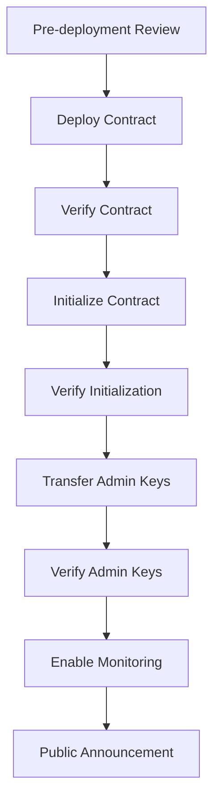
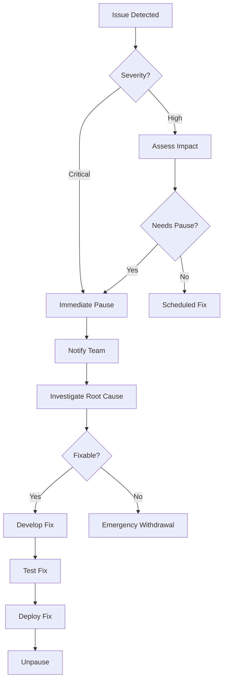

# 🚀 PrivacyLayer Mainnet Launch Checklist

> **Status:** 🔴 Not Ready | **Last Updated:** 2026-03-22
> 
> This checklist ensures PrivacyLayer is fully prepared for mainnet deployment.

---

## Table of Contents

1. [Security Checklist](#1-security-checklist)
2. [Audit Requirements](#2-audit-requirements)
3. [Testing Requirements](#3-testing-requirements)
4. [Deployment Procedures](#4-deployment-procedures)
5. [Rollback Plans](#5-rollback-plans)
6. [Communication Strategy](#6-communication-strategy)
7. [Launch Day Checklist](#7-launch-day-checklist)
8. [Post-Launch Monitoring](#8-post-launch-monitoring)

---

## 1. Security Checklist

### 1.1 Smart Contract Security

| # | Item | Status | Priority | Notes |
|---|------|--------|----------|-------|
| 1.1.1 | Reentrancy protection implemented | ⬜ | 🔴 Critical | Verify all external calls follow checks-effects-interactions |
| 1.1.2 | Integer overflow/underflow checks | ⬜ | 🔴 Critical | Soroban SDK provides built-in checks; verify explicit |
| 1.1.3 | Access control properly implemented | ⬜ | 🔴 Critical | Admin functions restricted; multi-sig for privileged ops |
| 1.1.4 | Input validation comprehensive | ⬜ | 🔴 Critical | All public functions validate inputs before processing |
| 1.1.5 | State machine integrity | ⬜ | 🟠 High | Contract states transition correctly; no invalid states |
| 1.1.6 | Event emission for all critical ops | ⬜ | 🟠 High | Deposits, withdrawals, admin changes emit events |
| 1.1.7 | Pause mechanism implemented | ⬜ | 🔴 Critical | Emergency stop capability for deposits/withdrawals |
| 1.1.8 | Upgrade path defined | ⬜ | 🟠 High | Contract upgradeability strategy documented |

### 1.2 Zero-Knowledge Circuit Security

| # | Item | Status | Priority | Notes |
|---|------|--------|----------|-------|
| 1.2.1 | Circuit logic reviewed by ZK expert | ⬜ | 🔴 Critical | Third-party review required |
| 1.2.2 | Commitment scheme soundness verified | ⬜ | 🔴 Critical | Poseidon hash collision resistance |
| 1.2.3 | Nullifier uniqueness guaranteed | ⬜ | 🔴 Critical | No double-spend vulnerabilities |
| 1.2.4 | Merkle tree implementation verified | ⬜ | 🔴 Critical | Depth=20; no edge cases in path construction |
| 1.2.5 | Proof verification gas efficiency | ⬜ | 🟠 High | BN254 pairing costs within limits |
| 1.2.6 | Trusted setup not required | ⬜ | 🟢 Medium | Verify Noir circuits use universal setup |
| 1.2.7 | Witness generation tested | ⬜ | 🟠 High | Client-side proof generation handles all edge cases |
| 1.2.8 | Constraint completeness | ⬜ | 🔴 Critical | No missing constraints in circuits |

### 1.3 Cryptographic Primitives

| # | Item | Status | Priority | Notes |
|---|------|--------|----------|-------|
| 1.3.1 | BN254 host function usage verified | ⬜ | 🔴 Critical | Correct usage of Protocol 25 primitives |
| 1.3.2 | Poseidon2 hash parameters validated | ⬜ | 🔴 Critical | Correct parameters for BN254 curve |
| 1.3.3 | Random number generation secure | ⬜ | 🔴 Critical | Client-side entropy for nullifier/secret |
| 1.3.4 | Key derivation tested | ⬜ | 🟠 High | If applicable for user keys |

### 1.4 Operational Security

| # | Item | Status | Priority | Notes |
|---|------|--------|----------|-------|
| 1.4.1 | Admin keys secured (multi-sig) | ⬜ | 🔴 Critical | Minimum 3-of-5 multi-sig |
| 1.4.2 | Deployer keys secured | ⬜ | 🔴 Critical | Hardware wallet for deployment |
| 1.4.3 | No hardcoded secrets | ⬜ | 🔴 Critical | Code scan for exposed keys/seeds |
| 1.4.4 | Dependency audit | ⬜ | 🟠 High | All dependencies scanned for vulnerabilities |
| 1.4.5 | CI/CD pipeline secured | ⬜ | 🟠 High | No unauthorized code execution in build process |

### 1.5 Privacy Guarantees

| # | Item | Status | Priority | Notes |
|---|------|--------|----------|-------|
| 1.5.1 | Deposit-withdrawal unlinkability | ⬜ | 🔴 Critical | No on-chain link between deposit and withdrawal |
| 1.5.2 | Note encryption secure | ⬜ | 🟠 High | If applicable; client-side encryption |
| 1.5.3 | Metadata minimization | ⬜ | 🟠 High | No unnecessary data stored on-chain |
| 1.5.4 | Front-running protection | ⬜ | 🟠 High | Mitigation for MEV attacks on withdrawals |

---

## 2. Audit Requirements

### 2.1 Audit Types Required

| Audit Type | Firm | Status | Report | Cost Budget | Timeline |
|------------|------|--------|--------|-------------|----------|
| Smart Contract Audit | ⬜ TBD | ⬜ Not Started | - | $50K-$100K | 4-6 weeks |
| ZK Circuit Audit | ⬜ TBD | ⬜ Not Started | - | $80K-$150K | 6-8 weeks |
| Economic/Token Audit | ⬜ TBD | ⬜ Not Started | - | $20K-$40K | 2-3 weeks |
| Cryptographic Review | ⬜ TBD | ⬜ Not Started | - | $30K-$60K | 3-4 weeks |

### 2.2 Recommended Audit Firms

**Smart Contract Auditors:**
- [ ] Least Authority (ZK expertise)
- [ ] Trail of Bits
- [ ] OpenZeppelin
- [ ] Spearbit
- [ ] Code4rena (competitive audit)

**ZK Circuit Auditors:**
- [ ] Least Authority
- [ ] Veridise
- [ ] 0xPARC
- [ ] PSE (Privacy & Scaling Explorations)

### 2.3 Audit Timeline

```
Week 1-2:  Auditor selection and contracting
Week 3-8:  Smart contract audit
Week 4-12: ZK circuit audit (parallel)
Week 9-10: Issue remediation
Week 11-12: Re-audit of fixes
Week 13:   Final report and sign-off
```

### 2.4 Bug Bounty Program

| # | Item | Status | Notes |
|---|------|--------|-------|
| 2.4.1 | Bug bounty platform selected | ⬜ | Immunefi, Sherlock, or HackerOne |
| 2.4.2 | Bounty tiers defined | ⬜ | Critical: $50K+, High: $10K+, Medium: $5K+ |
| 2.4.3 | Scope documented | ⬜ | In-scope contracts and circuits |
| 2.4.4 | Responsible disclosure policy | ⬜ | 90-day disclosure timeline |
| 2.4.5 | Launch timing | ⬜ | At least 2 weeks before mainnet |

---

## 3. Testing Requirements

### 3.1 Unit Tests

| Component | Coverage Target | Status | Notes |
|-----------|-----------------|--------|-------|
| Contract: deposit.rs | ≥95% | ⬜ | |
| Contract: withdraw.rs | ≥95% | ⬜ | |
| Contract: merkle.rs | ≥95% | ⬜ | |
| Contract: verifier.rs | ≥95% | ⬜ | |
| Contract: admin.rs | ≥95% | ⬜ | |
| Contract: nullifier.rs | ≥95% | ⬜ | |
| Circuit: commitment.nr | 100% | ⬜ | All constraints exercised |
| Circuit: withdraw.nr | 100% | ⬜ | All constraints exercised |
| Circuit: merkle lib | 100% | ⬜ | All constraints exercised |

### 3.2 Integration Tests

| # | Test Scenario | Status | Priority |
|---|---------------|--------|----------|
| 3.2.1 | Full deposit → withdraw flow | ⬜ | 🔴 Critical |
| 3.2.2 | Multiple deposits, single withdraw | ⬜ | 🔴 Critical |
| 3.2.3 | Multiple deposits, multiple withdrawals | ⬜ | 🔴 Critical |
| 3.2.4 | Concurrent deposits handling | ⬜ | 🟠 High |
| 3.2.5 | Merkle tree edge cases (empty, full) | ⬜ | 🟠 High |
| 3.2.6 | Invalid proof rejection | ⬜ | 🔴 Critical |
| 3.2.7 | Double-spend prevention | ⬜ | 🔴 Critical |
| 3.2.8 | Admin pause/unpause | ⬜ | 🔴 Critical |
| 3.2.9 | Emergency withdrawal | ⬜ | 🔴 Critical |
| 3.2.10 | Contract upgrade flow | ⬜ | 🟠 High |

### 3.3 Fuzz Testing

| # | Item | Status | Priority | Notes |
|---|------|--------|----------|-------|
| 3.3.1 | Fuzzing framework set up | ⬜ | 🟠 High | Use `proptest` or `cargo-fuzz` |
| 3.3.2 | Deposit input fuzzing | ⬜ | 🟠 High | Random amounts, addresses |
| 3.3.3 | Proof input fuzzing | ⬜ | 🔴 Critical | Malformed proofs, edge cases |
| 3.3.4 | Merkle tree fuzzing | ⬜ | 🟠 High | Large trees, invalid paths |
| 3.3.5 | Minimum 10M iterations | ⬜ | 🟠 High | Or until no bugs found for 48h |

### 3.4 Formal Verification (Recommended)

| # | Item | Status | Notes |
|---|------|--------|-------|
| 3.4.1 | Merkle tree invariant proofs | ⬜ | Mathematical proof of correctness |
| 3.4.2 | Nullifier uniqueness proof | ⬜ | Formal verification of double-spend protection |
| 3.4.3 | Commitment scheme soundness | ⬜ | Cryptographic security proof |

### 3.5 Testnet Deployment

| # | Item | Status | Notes |
|---|------|--------|-------|
| 3.5.1 | Deployed to Stellar Testnet | ⬜ | Soroban testnet |
| 3.5.2 | Public testnet phase | ⬜ | Minimum 4 weeks public testing |
| 3.5.3 | Bug bash event | ⬜ | Community testing with rewards |
| 3.5.4 | Load testing | ⬜ | Simulate high transaction volume |
| 3.5.5 | SDK integration testing | ⬜ | Client libraries tested on testnet |
| 3.5.6 | Frontend testing | ⬜ | dApp tested with real wallets |

---

## 4. Deployment Procedures

### 4.1 Pre-Deployment Checklist

| # | Item | Status | Responsible | Notes |
|---|------|--------|-------------|-------|
| 4.1.1 | All audits completed | ⬜ | Security Lead | Final reports available |
| 4.1.2 | All critical/high bugs fixed | ⬜ | Dev Team | Audit findings resolved |
| 4.1.3 | Testnet deployment successful | ⬜ | DevOps | At least 4 weeks stable |
| 4.1.4 | Bug bounty live | ⬜ | Security Lead | Minimum 2 weeks running |
| 4.1.5 | Deployment scripts tested | ⬜ | DevOps | Dry-run on testnet |
| 4.1.6 | Monitoring infrastructure ready | ⬜ | DevOps | Dashboards, alerts |
| 4.1.7 | Documentation complete | ⬜ | Tech Writer | User guides, API docs |
| 4.1.8 | Legal review complete | ⬜ | Legal | Terms, privacy policy |
| 4.1.9 | Insurance/coverage obtained | ⬜ | Operations | If applicable |
| 4.1.10 | Team trained on incident response | ⬜ | All | Runbook reviewed |

### 4.2 Deployment Steps



#### Step-by-Step:

| Step | Action | Command/Method | Verification |
|------|--------|----------------|--------------|
| 1 | Pre-deployment review | Run all checks above | All ✅ |
| 2 | Build optimized WASM | `cargo build --release --target wasm32-unknown-unknown` | Size check |
| 3 | Deploy contract | `stellar contract deploy` | Contract ID obtained |
| 4 | Verify deployment | Compare bytecode hash | Hash matches |
| 5 | Initialize contract | `initialize()` call | Events emitted correctly |
| 6 | Verify initialization | Query contract state | Config correct |
| 7 | Transfer admin to multi-sig | `transfer_admin()` | Multi-sig has control |
| 8 | Verify admin transfer | Check admin address | Multi-sig confirmed |
| 9 | Enable monitoring | Start dashboards | Alerts active |
| 10 | Public announcement | Blog post, socials | Published |

### 4.3 Contract Configuration

| Parameter | Testnet Value | Mainnet Value | Notes |
|-----------|---------------|---------------|-------|
| Denomination | 1 XLM / 10 XLM | TBD | Fixed deposit amounts |
| Merkle Tree Depth | 20 | 20 | ~1M deposits capacity |
| Deposit Fee | 0 | TBD | Platform fee if any |
| Withdrawal Fee | 0 | TBD | Platform fee if any |
| Paused | false | false | Start unpaused |

### 4.4 Verification Commands

```bash
# Verify contract bytecode
stellar contract inspect --id <CONTRACT_ID> --network mainnet

# Check contract state
stellar contract invoke --id <CONTRACT_ID> -- get_config

# Verify admin
stellar contract invoke --id <CONTRACT_ID> -- get_admin

# Check merkle tree state
stellar contract invoke --id <CONTRACT_ID> -- get_merkle_root
```

---

## 5. Rollback Plans

### 5.1 Emergency Scenarios

| Scenario | Severity | Response Time | Action |
|----------|----------|---------------|--------|
| Critical vulnerability discovered | 🔴 Critical | <1 hour | Immediate pause |
| Exploit in progress | 🔴 Critical | <15 min | Pause + incident response |
| Funds at risk | 🔴 Critical | <30 min | Emergency withdrawal |
| Non-critical bug found | 🟠 High | <24 hours | Assess and patch |
| Performance degradation | 🟡 Medium | <48 hours | Investigate and optimize |
| User complaints | 🟢 Low | <72 hours | Support escalation |

### 5.2 Emergency Pause Procedure



#### Pause Commands:

```bash
# Emergency pause (requires multi-sig)
stellar contract invoke --id <CONTRACT_ID> -- pause

# Verify paused
stellar contract invoke --id <CONTRACT_ID> -- is_paused
```

### 5.3 Emergency Withdrawal Procedure

**Only used if:**
- Contract is irreparably compromised
- Funds must be returned to users
- Approved by 4-of-5 multi-sig signers

#### Steps:

| Step | Action | Notes |
|------|--------|-------|
| 1 | Multi-sig approval | At least 4 signers agree |
| 2 | Execute emergency withdrawal | Call `emergency_withdraw()` |
| 3 | Verify fund distribution | All users can claim |
| 4 | Publish incident report | Full transparency |
| 5 | Post-mortem analysis | Document lessons learned |

### 5.4 Contract Upgrade Path

**If upgrade required (non-emergency):**

| Step | Action | Verification |
|------|--------|--------------|
| 1 | Deploy new contract | New contract ID |
| 2 | Migrate state | Verify data integrity |
| 3 | Update references | SDK, frontend updated |
| 4 | Deprecate old contract | Mark as deprecated |
| 5 | User communication | Migration guide published |

---

## 6. Communication Strategy

### 6.1 Pre-Launch Communication

| # | Item | Status | Target Date | Notes |
|---|------|--------|-------------|-------|
| 6.1.1 | Launch announcement drafted | ⬜ | T-7 days | Blog post ready |
| 6.1.2 | Social media posts prepared | ⬜ | T-7 days | Twitter, Discord, Telegram |
| 6.1.3 | Press release ready | ⬜ | T-7 days | If applicable |
| 6.1.4 | Documentation finalized | ⬜ | T-3 days | User guides, API docs |
| 6.1.5 | FAQ published | ⬜ | T-3 days | Common questions answered |
| 6.1.6 | Tutorial videos created | ⬜ | T-3 days | Deposit/withdraw demos |

### 6.2 Launch Day Communication

| Time (UTC) | Action | Channel | Responsible |
|------------|--------|---------|-------------|
| T-2h | Internal team notification | Slack/Discord | PM |
| T-1h | Final deployment verification | Internal | DevOps |
| T-0 | Launch announcement | Blog + Twitter | Marketing |
| T+0.5h | Community notification | Discord + Telegram | Community |
| T+1h | Press outreach | Email | PR |
| T+2h | Monitor social sentiment | Social | Community |
| T+4h | Status update | Twitter | PM |
| T+24h | Day 1 summary | Blog | PM |

### 6.3 Incident Communication

#### Severity Levels:

| Level | Name | Response | Communication |
|-------|------|----------|---------------|
| 🔴 P0 | Critical | Immediate | All channels, every 30 min |
| 🟠 P1 | High | <4 hours | All channels, every 2 hours |
| 🟡 P2 | Medium | <24 hours | Discord + Twitter, daily updates |
| 🟢 P3 | Low | <72 hours | Discord, as needed |

#### Communication Templates:

**Critical Incident (P0):**
```
🚨 PRIVACYLAYER INCIDENT ALERT 🚨

Status: [INVESTIGATING/IDENTIFIED/MONITORING/RESOLVED]
Impact: [Description of user impact]
Start: [Timestamp UTC]
Current: [Timestamp UTC]

We are actively investigating. Updates every 30 minutes.

Next update: [Time UTC]
Status page: https://status.privacylayer.io
```

**Resolution:**
```
✅ PRIVACYLAYER INCIDENT RESOLVED ✅

Summary: [Brief description]
Duration: [Total time]
Impact: [Users affected]
Root Cause: [If known]
Remediation: [Actions taken]

Post-mortem: [Link to be published]

Thank you for your patience.
```

### 6.4 Post-Launch Communication

| # | Item | Status | Timeline |
|---|------|--------|----------|
| 6.4.1 | Weekly metrics report | ⬜ | Every Monday |
| 6.4.2 | Monthly security update | ⬜ | First of month |
| 6.4.3 | Quarterly roadmap review | ⬜ | End of quarter |
| 6.4.4 | User feedback collection | ⬜ | Ongoing |
| 6.4.5 | Feature request tracking | ⬜ | Ongoing |

---

## 7. Launch Day Checklist

### 7.1 T-24 Hours

| # | Item | Status | Responsible |
|---|------|--------|-------------|
| 7.1.1 | Final code review | ⬜ | Tech Lead |
| 7.1.2 | All tests passing | ⬜ | CI/CD |
| 7.1.3 | Deployment scripts reviewed | ⬜ | DevOps |
| 7.1.4 | Monitoring dashboards ready | ⬜ | DevOps |
| 7.1.5 | Team on-call schedule set | ⬜ | PM |
| 7.1.6 | Communication assets ready | ⬜ | Marketing |
| 7.1.7 | Support team briefed | ⬜ | Support Lead |

### 7.2 T-0 (Launch)

| # | Item | Status | Responsible |
|---|------|--------|-------------|
| 7.2.1 | Deploy to mainnet | ⬜ | DevOps |
| 7.2.2 | Verify deployment | ⬜ | DevOps |
| 7.2.3 | Initialize contract | ⬜ | Tech Lead |
| 7.2.4 | Transfer admin keys | ⬜ | Tech Lead |
| 7.2.5 | Enable monitoring | ⬜ | DevOps |
| 7.2.6 | Execute test deposit | ⬜ | QA |
| 7.2.7 | Execute test withdrawal | ⬜ | QA |
| 7.2.8 | Publish announcement | ⬜ | Marketing |
| 7.2.9 | Social media blast | ⬜ | Marketing |
| 7.2.10 | Support channels active | ⬜ | Support |

### 7.3 T+24 Hours

| # | Item | Status | Responsible |
|---|------|--------|-------------|
| 7.3.1 | Review metrics | ⬜ | PM |
| 7.3.2 | Address any issues | ⬜ | All |
| 7.3.3 | Publish day 1 summary | ⬜ | PM |
| 7.3.4 | User feedback review | ⬜ | Support |
| 7.3.5 | Bug triage | ⬜ | Tech Lead |

---

## 8. Post-Launch Monitoring

### 8.1 Technical Monitoring

| Metric | Alert Threshold | Status | Notes |
|--------|-----------------|--------|-------|
| Transaction success rate | <99% | ⬜ | |
| Deposit latency | >30s | ⬜ | |
| Withdrawal latency | >60s | ⬜ | ZK proof generation |
| Contract errors | >0.1% | ⬜ | |
| Gas usage spike | >2x average | ⬜ | |
| Merkle tree depth | >90% capacity | ⬜ | |
| Nullifier duplicates | >0 | ⬜ | Critical alert |
| Failed proof verifications | >5% | ⬜ | |

### 8.2 Business Metrics

| Metric | Tracking | Status | Notes |
|--------|----------|--------|-------|
| Total Value Locked (TVL) | Daily | ⬜ | |
| Unique depositors | Daily | ⬜ | |
| Unique withdrawers | Daily | ⬜ | |
| Transaction volume | Daily | ⬜ | |
| User retention | Weekly | ⬜ | |

### 8.3 Security Monitoring

| Item | Frequency | Status | Notes |
|------|-----------|--------|-------|
| Smart contract events | Real-time | ⬜ | All events logged |
| Large transactions | Real-time | ⬜ | Alert on >10K XLM |
| Admin actions | Real-time | ⬜ | Alert on any admin call |
| Failed transactions | Real-time | ⬜ | Log and investigate |
| Unusual patterns | Daily | ⬜ | ML-based detection |

### 8.4 Operational Readiness

| # | Item | Status | Notes |
|---|------|--------|-------|
| 8.4.1 | On-call rotation established | ⬜ | 24/7 coverage |
| 8.4.2 | Incident runbook ready | ⬜ | All scenarios covered |
| 8.4.3 | Escalation path defined | ⬜ | Clear chain of command |
| 8.4.4 | Backup deployer keys secured | ⬜ | Hardware wallet |
| 8.4.5 | Status page configured | ⬜ | status.privacylayer.io |

---

## Sign-Off

| Role | Name | Date | Signature |
|------|------|------|-----------|
| Tech Lead | | | ⬜ |
| Security Lead | | | ⬜ |
| DevOps Lead | | | ⬜ |
| Product Manager | | | ⬜ |
| Legal | | | ⬜ |

---

## Revision History

| Version | Date | Author | Changes |
|---------|------|--------|---------|
| 1.0 | 2026-03-22 | PrivacyLayer Team | Initial checklist |

---

*This checklist is a living document. Update as requirements evolve and lessons are learned.*